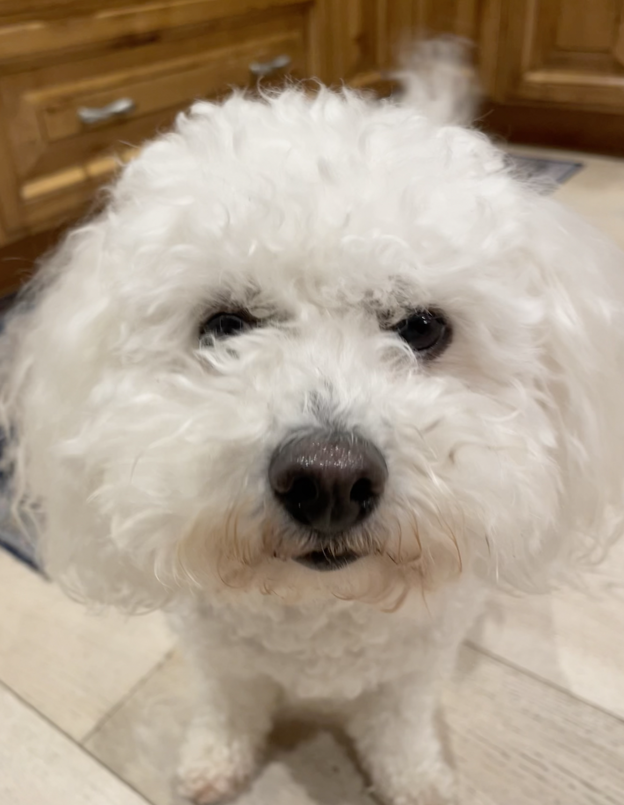
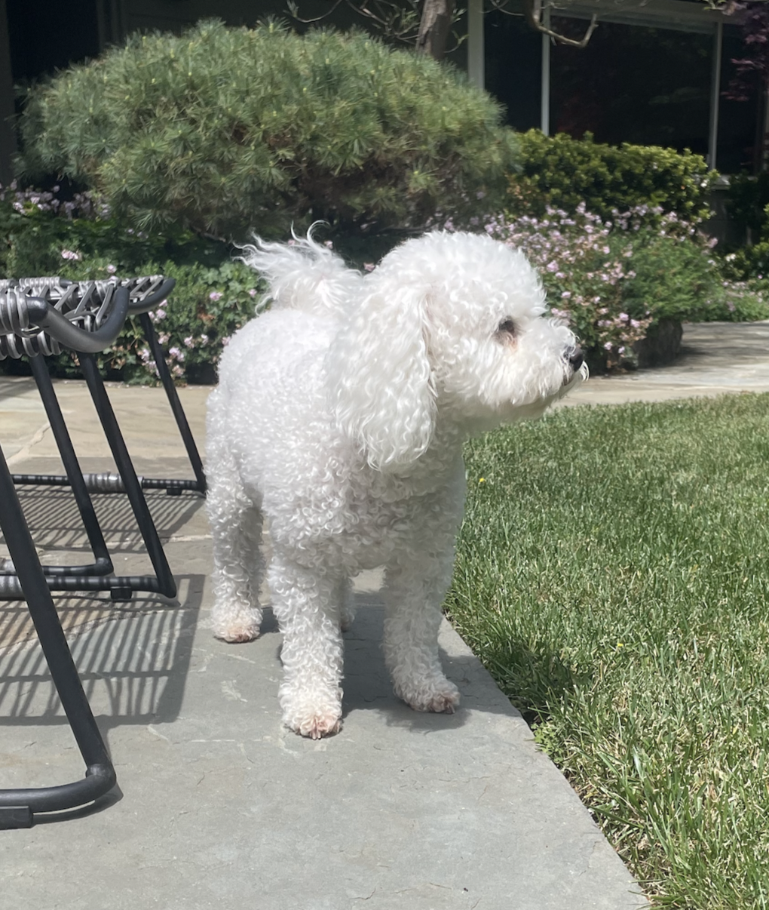

## 基本信息

本站使用 [GitHub Pages](https://pages.github.com/) 作为托管平台，[Hugo](https://gohugo.io/) 作为静态网站生成器，并通过 [IONOS](https://www.ionos.com/) 管理自定义域名。背景来自[Jeffrey Hemsworth_Unsplash](https://unsplash.com/photos/an-abandoned-factory-building-with-stairs-leading-up-to-it-vMwLi4apFOA)

📓 查看[网站更新日志]()

special thanks to 友邻`白石京`的[网站装修小技巧](https://thirdshire.com/tags/%E5%8D%9A%E5%AE%A2%E5%BB%BA%E7%AB%99/)和友邻`Yelle`的[hugo stack 主题美化](https://yelleis.top/p/hugo-theme-stack-beautification/)，照猫画虎地魔改了[stack](https://github.com/CaiJimmy/hugo-theme-stack)主题，真是方便！傻瓜式教程见[草履虫看了也能建自己的个人网站]()

## 自我介绍

可以叫我象🐘，叫本人的毛象id也可以。女的，intp，学生，adhd

📋 查看[博客作者问卷]()

💌 查看[书影音游收藏]() 和 [零零碎碎收藏]()

请问你看到我的狗了吗？没丢，只是我想让所有人都看看

 

## 我的足迹

最喜欢的还是318国道 我❤️无人区^^

说来好笑，从来没有以旅游为目的去过别的国家，好想出国玩啊……

（使用Google map记录 不确保在墙内能正常加载）

  <iframe 
    src="https://www.google.com/maps/d/u/1/embed?mid=13m3n-fbAoM2H3LZt7SFchwGkp-Ikh60&ehbc=2E312F&noprof=1"
    width="100%" 
    height="100%" 
    allowfullscreen="" 
    loading="lazy"
    style="border:0;"
    referrerpolicy="no-referrer-when-downgrade">
  </iframe>

## AI Policy

由于本人的adhd，说话有点找不到重点，颠三倒四的。如果不用ai帮我制作大纲完善逻辑，我只会端出一坨💩。

However，作为一名在AI领域活动的人，我对ai policy还是相当理解并遵守的。在每篇使用ai的文章中我都会credit具体的模型以及他们做了哪些事，就像我的学校对我们上课作业的要求一样。

## 标签说明

`Meaningness`：输出无意义的观点

`Nothingless`：搞点没必要的艺术

`Repost`：转载喜欢的东西

`Witness`：重大事件发生时我的视角

`Maintain`：网站装修相关

## 联系方式

fediverse（常用） `xxyyzz1@tuta.io`（不经常看）
