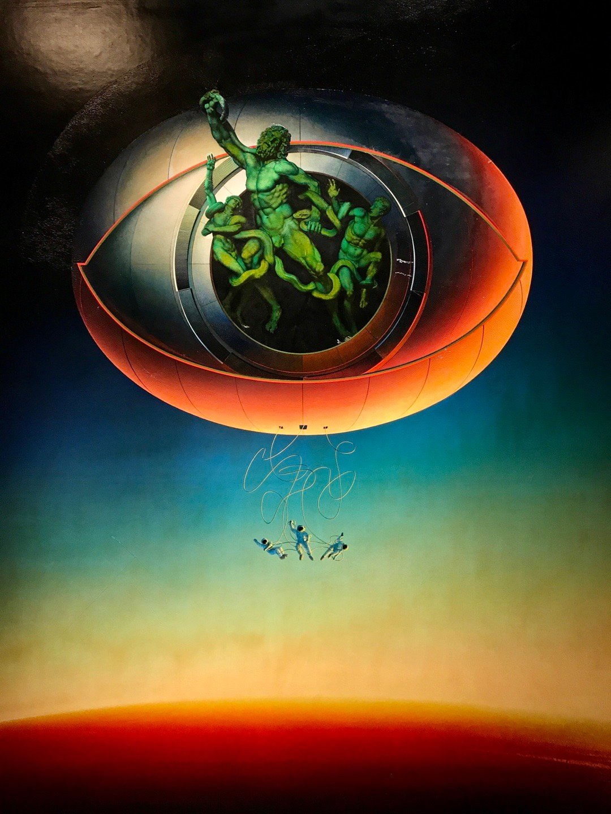


为了保证可读性使用GPT与Gemini进行润色


一直很爱逛美术馆，突然想起离开家上学前，在中国美术馆看到的作品。那是一幅让我久久无法移开目光的画作，而我在这两年间时时回想，今天终于感到必须要记录下来。

画作的名字是《轨迹中的拉奥孔》，作者是鲁道夫·豪斯纳。一开始吸引我的，是那令人震撼的视觉冲突——古典雕塑与宇航员同处一帧画面，像是某种遥远神祇与未来灵魂的对望。但越看越觉得，它讲的不是过去，也不是未来，正是我们所处的当下。

## 神话与科技的共振

画作中，美术课本里的老熟人，拉奥孔雕像，正以一种既熟悉又陌生的姿态呈现。在深入豪斯纳的科幻版拉奥孔之前，不妨让我们先回顾一下这位老朋友的故事。

**拉奥孔的悲歌：一个不被听取的警告**

这座著名的古希腊雕塑（我们今天看到的大多是公元一世纪左右的罗马大理石复制品，据信原作是更早期的青铜雕塑），生动地再现了特洛伊战争中的一幕悲剧。拉奥孔是特洛伊城的一名祭司。当希腊人假装撤退，在城外留下巨大的木马时，正是拉奥孔洞察了危机，声嘶力竭地警告特洛伊人：“不要相信这匹马，希腊人即使带着礼物也是危险的！”他甚至用长矛投掷马腹，试图揭示其中隐藏的阴谋。

然而，命运弄人。诸神决意要毁灭特洛伊，派来了两条巨大的海蛇。在众目睽睽之下，海蛇从海中蜿蜒而出，先是缠死了拉奥孔的两个年幼的儿子，继而将这位绝望的父亲也一并绞杀。特洛伊人目睹此景，误以为这是拉奥孔亵渎神圣木马而遭受的天谴，于是更加坚信木马是献给神的礼物，并将其拖入城内，最终导致了特洛伊的陷落。

因此，拉奥孔的故事充满了悲剧性的张力：他是真理的先知，却因道出真相而死。他是绝望的父亲，无力拯救自己的孩子。他的死，更讽刺地促成了灾难的发生。这座雕塑以其高度写实的技法、人物动态的强烈戏剧性以及对人类极致痛苦的深刻描绘，成为了古希腊化时期艺术的典范之作。自1506年在罗马重新出土以来，它便对西方艺术产生了深远影响，无数艺术家为之着迷，并从中汲取灵感。

**豪斯纳的二次创作：从古典悲剧到宇宙警示**

了解了原作的背景，再来看豪斯纳的画作，便更能体会其挪用与再创的匠心。他笔下的拉奥孔是绿色的，正如最开始的青铜雕塑，被强行嵌入一个充满未来感的金属舱口或某种高科技装置之中——它像是一个冰冷的观察孔，一个凝视深空的太空望远镜，又或是一个精密复杂的监控设备，甚至让人联想到尚在萌芽的脑机接口。

而在其下方，是三位身着宇航服的渺小身影，漂浮在泛着黄蓝诡谲渐变的宇宙背景里。他们仿佛漫无目的，失去了对自身轨迹的掌控权，身上缠绕着的细长线缆，看似是维系生命的供给线，却在视觉上形成了新的、无形的桎梏。他们像是挣脱了地球的引力，逃离了拉奥孔式的肉体挣扎，却又跌入了另一种失重状态下的束缚。

乍看之下，是摆脱束缚的自由；细品之下，却是另一种形式的失控。

## 时代的烙印与艺术家的追问

这幅画的创作横跨了1969年到1976年，那是一个在人类历史上留下浓墨重彩的时期。1969年，美国宇航员首次登月，将人类对太空的探索推向高潮，这被许多人视为技术理性的辉煌胜利。然而，这胜利宣言的背后，却是冷战的阴霾和核军备竞赛的步步紧逼。科技，在那个年代，不仅仅是探索未知的工具，更是意识形态角逐的利器。普通民众一面为技术的飞速发展而欢欣鼓舞，另一面却深陷于核威慑和技术异化的隐忧之中。

奥地利艺术家鲁道夫·豪斯纳（Rudolf Hausner）是一位奥地利画家、雕塑家和版画家，被誉为“心理现实主义者”和“第一位精神分析画家” 。他的作品融合了超现实主义和象征主义元素，深入探索人类意识和潜意识的复杂性。他的早期作品曾被纳粹斥为“堕落艺术”。1941年，他被征召入伍，服役于德军，直到战争结束。战争期间的经历对他产生了深远影响，在前线极端环境下获得了他称之为“塔特拉山脉木屋体验”的“精神震撼”\[1]。这无疑塑造了他对人性、权力与生存困境的深刻洞察。战后，豪斯纳回到维也纳，深入研究超现实主义，特别是马克斯·恩斯特的作品 。1947年，他与沃尔夫冈·胡特和安东·莱姆登共同创立了“维也纳幻想现实主义学派”，该学派将传统绘画技巧与幻想主题相结合，成为奥地利最重要的艺术运动之一 。他致力于通过艺术探索人类的精神分析与潜意识中的象征语言，坚信现代艺术的使命不应止步于描绘现实，更要揭示人类内心深处的幻想与永恒困境。

正是在这样的时代背景与个人经历的交织下，豪斯纳提出了这样的发言\[2]：

> “拉奥孔意味着警告，同时也意味着技术要赋予人性的要求。我为大家举荐的是更多的拉奥孔意识。”

在那个技术崇拜十分狂热的年代，这句话无异于一声刺耳的警钟。它质疑着人类是否真的凭借理性掌控了一切。我们以为自己驯服了命运的缰绳，殊不知可能只是被新的“巨蛇”所缠绕——这一次，蛇的名字或许叫科技、权力，或者某种看不见的系统。

因此，《轨迹中的拉奥孔》远非对古典艺术的简单致敬，而是一次对人类命运的深刻反问：当我们将神话中那条象征命运的蛇替换成宇航员的维生线缆时，我们真的挣脱了宿命的束缚，还是陷入了新的迷局？

## 古典悲剧与现代困境

豪斯纳的艺术创作本身就是一场自我探索的过程，他画作中反复出现的“亚当”形象，象征着一种人类集体原型\[3]。从这个角度看，《轨迹中的拉奥孔》中的拉奥孔形象，不仅仅是一尊冰冷的雕塑，更是人类在面对不可抗力（无论是远古的神明、无常的命运，还是今天无孔不入的技术系统）时，集体潜意识的投射和精神深处的本能反应。

而被高科技包裹的宇航员，也不再仅仅是人类科学成就的图腾。他们在画面中的漂浮状态，极具心理隐喻色彩：失重、失向、失依。这不仅仅是物理状态的描绘，更是对现代人某种精神状态的写照——一种在巨大、复杂的系统面前，个体感受到的无力感与方向迷失。这种表达，让人想起弗洛伊德的很多观点。当外部压迫过于强大、内部驱力又无处释放时，个体可能陷入一种功能性的游离与自我解体。

拉奥孔的痛苦是具体的、可见的，源于神罚与蛇噬；而宇航员的困境则更为隐蔽和冰冷，源于对技术系统的过度依赖和无形规训。他们身上连接的线缆，不正像是缠绕拉奥孔的现代版巨蛇吗？从有形的自然／神力压迫，到无形的系统／技术控制，人类的挣扎似乎从未停止，只是变换了形式。

## 技术解放，还是新的牢笼？

拉奥孔因试图揭示木马的真相而遭受神罚，他象征着人类在追求真理过程中可能付出的惨痛代价。在豪斯纳的画笔下，这位悲剧英雄被供奉或囚禁于一个仿佛来自未来的精密仪器之中，既像一个警世的标本，又像一个沉默的祷告者。

画作下方漂浮的宇航员，不再只是未来探索的先锋形象，更像是现代社会中数以亿计的你我——看似自由穿梭，实则被数据和系统控制。

科技曾被视为解放的号角，但算法过滤我们的兴趣，推荐内容与消费路径也愈发精准。我们在效率中感受到轻松，却可能在不知不觉中失去了自主思考的乐趣与能力。

AI可以协助我们写邮件、制定方案、甚至创作图像，节省了时间，也消磨了大脑主动参与的意愿。“思考”开始自动化，“选择”越来越像AI制定好的计划。

在这样的背景下，豪斯纳提出的“拉奥孔意识”不再是一种历史性的悲剧隐喻，而是现代人亟需拾起的精神姿态。面对高度智能化的日常，我们更需要警觉、分辨与坚守，用清醒的视角对抗AI系统的温水煮青蛙。

## 轨迹之内，警示不息

“轨迹”（Umlaufbahn）这个词，本身带有一种宿命感和循环往复的意味。它曾令人联想到宇宙探索的激动人心——速度、拓展、通往未知。但在这幅画的语境下，它更像是一种封闭的轨道：人类似乎被困在自己创造的技术系统之中，科技的翅膀并未让我们如神般自由，反而可能让我们更像远古神话中那些追逐虚幻之光、最终却被命运或神祇抛弃的悲剧角色。

当拉奥孔在海边痛苦挣扎时，他尚有信仰（尽管神最终背弃了他）和反抗的意志。而今天的我们，则身处AI、算法与各类智能系统织就的庞大网络中，逐渐成为被观看、被分析、甚至被操控的现代雕塑。

在日益舒适化、便捷化、虚拟化的生活体验中，我们不再被剧烈的痛苦唤醒，而是逐渐适应并沉溺于一种无声的麻木之中。人性的清醒、个体的尊严，似乎正悄然从我们的手中滑落。

《轨迹中的拉奥孔》不是一幅简单的复古画，也不是一幅纯粹的未来主义幻想图。它是一个时代的深刻问号，是我们今日处境的一面冷峻镜子。

拉奥孔在与神（或命运）的力量抗争；宇航员看似摆脱了地球的束缚，在太空中自由漂浮。然而，他们或许都未能逃脱某种更宏大的闭环——那不仅是空间的闭环，更是意识的闭环，是技术发展与人类主体性之间永恒的张力。

这幅画穿越时空，向我们发问：技术引领我们越走越远，甚至开始重塑我们的思维与存在方式，但我们，真的清楚自己要往哪里去吗？又或者，在这条看似无限延伸的轨迹上，我们是否正在失去接收警告和选择方向的能力？

---

\[1] [https://en.wikipedia.org/wiki/Rudolf\_Hausner](https://en.wikipedia.org/wiki/Rudolf_Hausner)

\[2] 中国美术馆展览引述，《轨迹中的拉奥孔》作品解读，或参见：[https://milenaolesinska.blogspot.com/2016/01/surrealism-rudolf-hausner.html](https://milenaolesinska.blogspot.com/2016/01/surrealism-rudolf-hausner.html)

\[3] [https://www.arsmundi.de/en/artists/hausner-rudolf/](https://www.arsmundi.de/en/artists/hausner-rudolf/)


