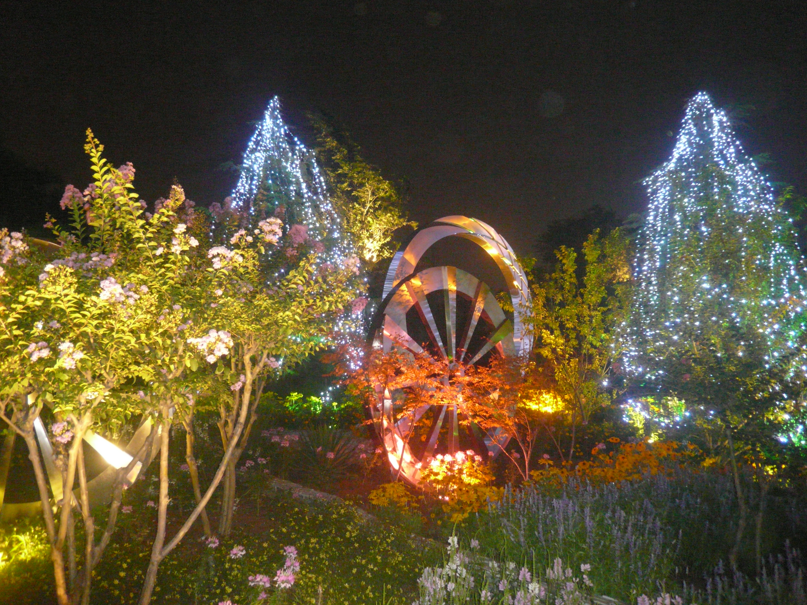
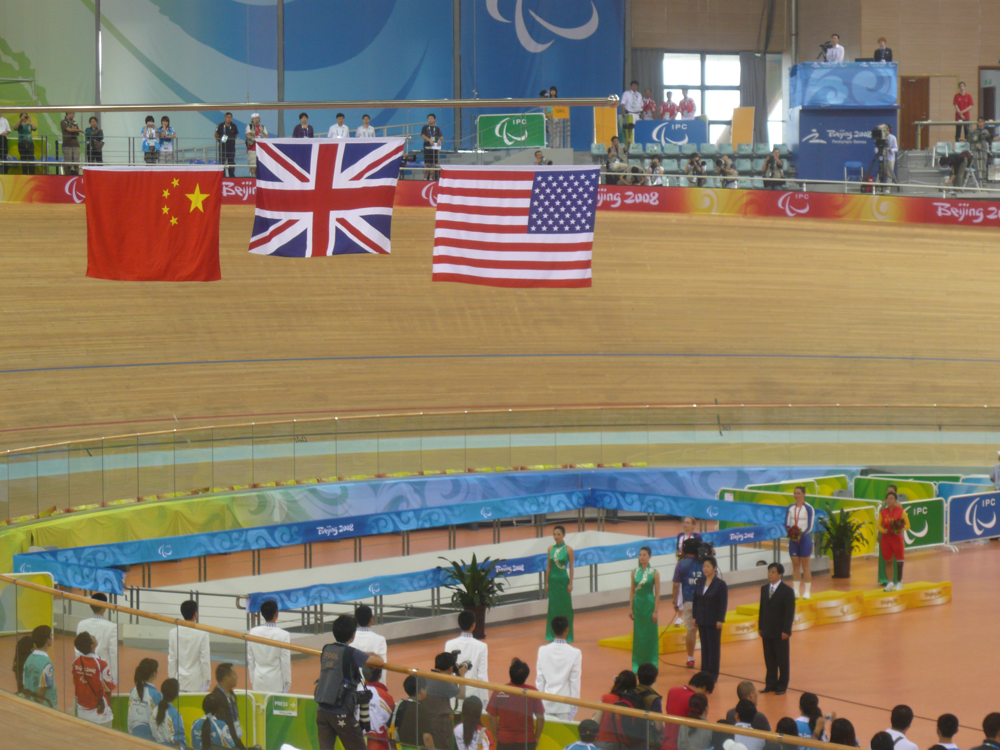
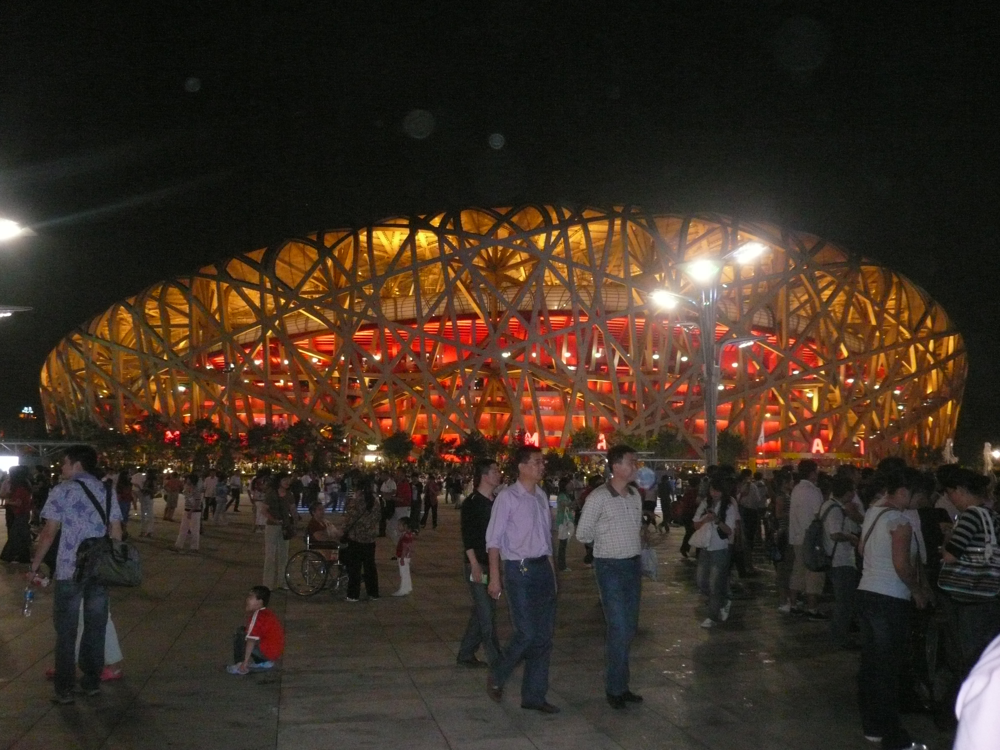
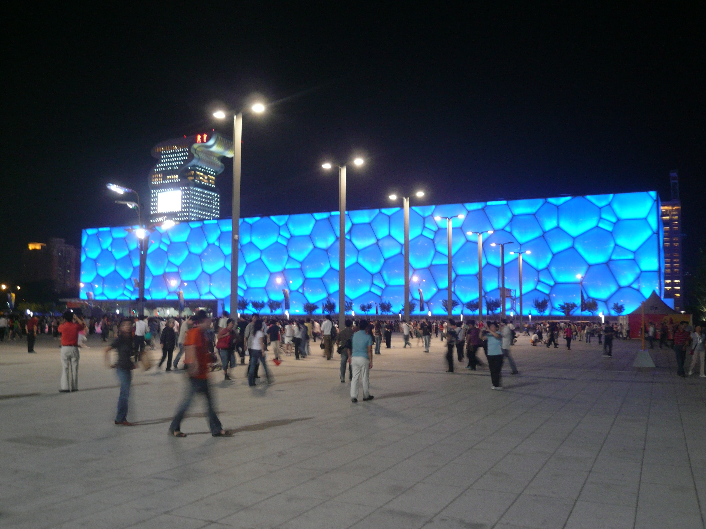
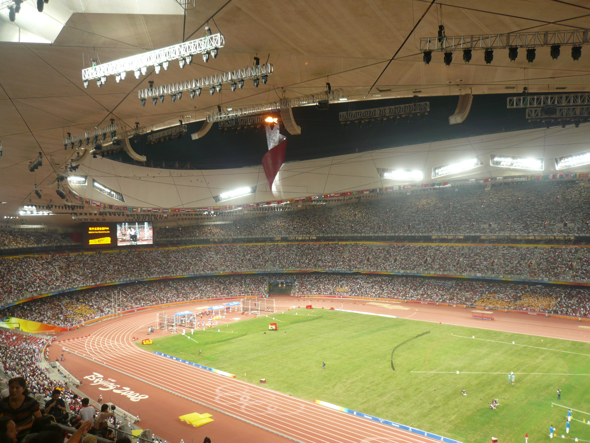

> 你覺得什麼是「家」？你的家鄉是怎樣的呢？
> 這個地方是家族的發源地、你長大的地方、父母所在地，還是你自己選擇的居所？和我們談談你心中的「家」是什麼以及它的面貌吧。

家对我来说应当是我感到舒服的地方，一个人呆着舒服，周围的人和环境也让我感到舒适。只可惜辗转多地，还没有一个完全让我觉得舒服的地点用于安家。我现在大概算一个homeless。

家乡就是另一个概念了，家乡是与生俱来无法更改的一个地方。爷爷奶奶姥姥姥爷都在钢铁厂工作，我的家乡，自然是钢厂分给我们的房所在的小区。楼下有一条内部道路，双向两车道，有大铁门拦着，我和几个小孩总是在那里骑车、奔跑。往小区中心走，有一些卖馒头包子花卷的小店，有老家肉饼，我喜欢吃那里的盖饭，有一个灯光不太亮的只卖蔬菜和干货的菜市场。路对面是邮政储蓄银行和一个大桑树（我可喜欢爬上爬下摘桑葚），还有幼儿园，时常。小区外面，一边是地铁站，另一边是一座小山。小山后来被开发了，变为奥运场馆，放了很多金属圆环状雕塑。08年的时候锃光瓦亮，能当镜子用。后来不知道哪年我再路过，它们的表面布满灰蒙蒙的雨点蒸发后的痕迹。毕竟那些年北京还有沙尘暴，仔细维护也是无用功。又不是鸟巢，世界各地的人都来看，不过就是我们这几个周边小区的人饭后消食的场所罢了，用不上维护。

 

放在我们这的奥运场馆确实不是什么大项目，几个骑自行车的项目而已，要不是修家门口我可能这辈子都不会听过。我们也去看了，在刺眼的阳光下排很长的队，在队伍边反光的白色帐篷上看到一些中文和英文字（我第一次学会volunteer是志愿者的意思），看到一些外国人，大家在山脚下盯着大屏幕——然后我意识到还不如在家看电视呢。后来我们又去鸟巢，巨大的田径场每个角落都有项目，放眼望去完全不知道谁在哪里干什么，我又觉得不如看电视了。

 

按理说，把奥运场馆放在这里之后，我们应该被带动着去健身（嗯 我有在一同修建的崭新游泳馆里学会蛙泳）。但是，说来好笑，用于承载游客的停车场，是把健身器材推倒之后建立的。我少了好多娱乐设施。好在建好停车场之前的土堆也很好玩，我们几个小孩就在那里玩土。后来逐渐荒废，没人来停车，改建成了一个巨大的菜市场。我特别喜欢吃那里的千层肉饼。饼皮炸得十分酥脆，不知道是花椒油还是什么香料，咬一口是肉和刺激的香味，让人无法拒绝油和碳水。只可惜那时我们已经搬走了，也就是偶尔开车路过，会去那里买菜，我就缠着妈妈给我买一个。后来我上学很忙，不去那边了，只是偶尔回家会发现桌子上放着牛肉饼，高兴地把书包一甩扑上去。

也不知那令人魂牵梦绕的千层饼如今是否还在售卖，距离我最后一次去大概也有五六年了。

我的另一个精神上的家，竟也和奥运会有关系。我的大学离奥林匹克森林公园很近，也就五六公里。在如鸽子笼一般的校园里，奥森是我唯一能放松身心的地方。我有时候在公园里面骑车散步，有时候在外面的绿色步道骑车，还有的时候骑到旁边的国家会议中心或者什么气派的大楼边上，这种承载了权力机构功能的巨大建筑因为无人进出让我有一种莫名的安心感。

> 寫一件最能讓你想起「家」的物件。
> 人們會以不同的形容詞來訴說「家」，比如是溫暖、幸福、束縛、想要逃離等。有什麼物件盛載著你對家的各種情感，又能讓你想起家的？可以跟我們描述一下那件物件嗎？

在我很小的时候，可能小到我弟还没有出生，或者弟才一两岁，我和爷爷奶奶生活。爷爷家是三室一厅的构造，但日常只有爷爷奶奶两个人住。最小的屋子，用于存放一些很老的物件。就连电灯开关都是拉绳的，打开还有频闪，老气极了。我奶奶有时候会在这个小黑屋里玩电脑，空当接龙，这是奶奶最爱的游戏。我爷爷会在另一个屋玩蜘蛛纸牌，而我最爱的是三维弹球，我们三个就是这样的网瘾老年和网瘾幼儿。小黑屋除了有玩游戏的我奶奶，其他的地方堆满了很古老的东西，随便拿出一样应该都是80年代的，我爸还在上小学的年纪。我小时候悄悄溜进那个屋子看到了我姑姑小学时候用的铅笔盒，感到十分有意思，比我自己用的迪士尼公主的特别许多，一想到铅笔盒就能想起家来。等我到了离开家的年纪，我已经不需要笔袋了。甚至纸笔都不需要了，兜里放一支保证特殊情况足够。

> 那天，你離開了家，是怎樣的感受？
> 人一直都在流動，你有離開過你的家，到別處生活嗎？有什麼難以忘懷的時刻，比如說第一次離家那天的場景。跟我們說說當中發生的故事吧。如果你沒有到他鄉長居的經驗，那有到過異地嗎。離開家後，是怎樣的感受？

最后检查了行李，和家里的鸟告别，带上了鸟的羽毛、狗年事已高松动脱落的虎牙、已经去世的姥姥姥爷以前去美国玩没花完的五十美元，我就这么出发了。

在首都机场，妈和弟陪我checkin行李，爸去停车，然后我们等了一会，买了点零食，在安检门口拥抱，然后就没有然后了。

其实也只是离开我的家人，去美国找另一些家人，并不算完全离开家，所以家人们和我都不是特别难过。我甚至还在为美联航的飞机上有免费Wi-Fi高兴呢。

后来又独自一人去更远的地方读研，反而感到了一种远离家人的自由自在。正如算着玩的命所说，似乎就是缘分比较浅，离家远是正常的。

> 回家的感覺是什麼樣的？你會形容為「回去」還是「回來」？
> 不論是久久離開家鄉再重回、又或是短暫的告別而重回，回家那瞬的感覺是怎樣的？比如說是複雜的、疏遠的又或重新連接起來。能否回想一下，分享你心裡想訴說的感受？

先空着，等我回国的那天再写吧

---
问题来源：[七日書 #2 開放報名｜陪你完成人生日記：書寫家與故鄉](https://matters.town/a/u3qna0i5t2m5)


