最近我发现太无聊了没东西写，决定慢慢地补我们去过的地方的游记。不过问题在于我实在是一个懒得做计划的人，行程机票酒店甚至在哪里吃饭都不是我决定的，我的任务只是准时上飞机以及带好证件。所以很怀疑我的游记会写成什么样。

---

3月初对我们所在的地方还是很冷，于是我们决定去拉斯维加斯暖和暖和！

## 住

感谢Hilton的听课房[1]，所以我们花很少的钱就住到了不错的酒店：金色的Trump tower。从远处望去实在像一块巨大的金砖立在地面上，阴天尤其亮，尤其像一块大金子，透露着一种暴发户的氛围。实在是有点丑，而这也是我们选择它的原因：只有住在里面才不会看到它的外立面。

- 外部环境：离strip略远，公交站再走几百米，没有赌场，很安静。但对于游客来说还是太累了，很想让男朋友把我拖回去
- 内部设施：老但很干净，除了该有的东西以外竟然还有厨房，头一次住到两室一厅卫生间（淋浴间马桶间和客厅的洗手池浴缸）
- 60多层，电梯分为1-30和31-60两段，速度很快，想起去帝国大厦的电梯
- 纪念品商店：都Trump tower了，不卖trump周边才让人奇怪。巨大的MAGA帽子要来一个吗？

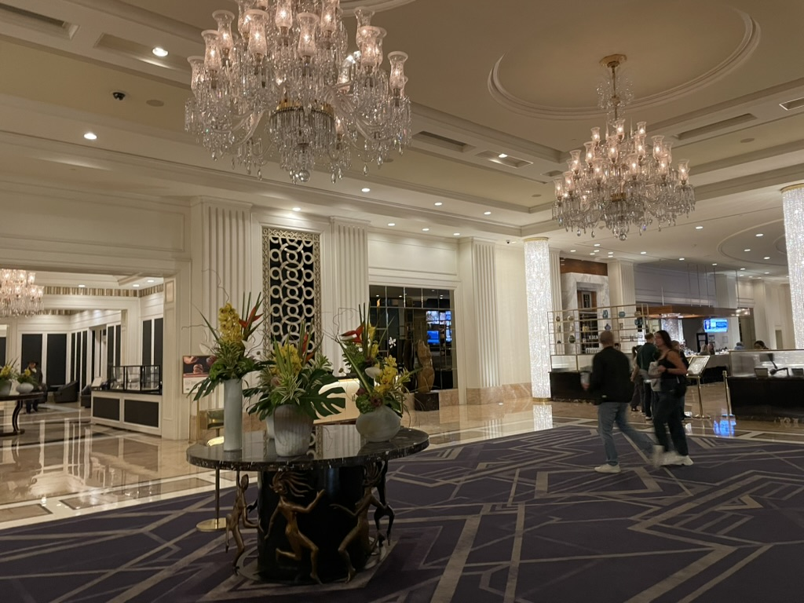 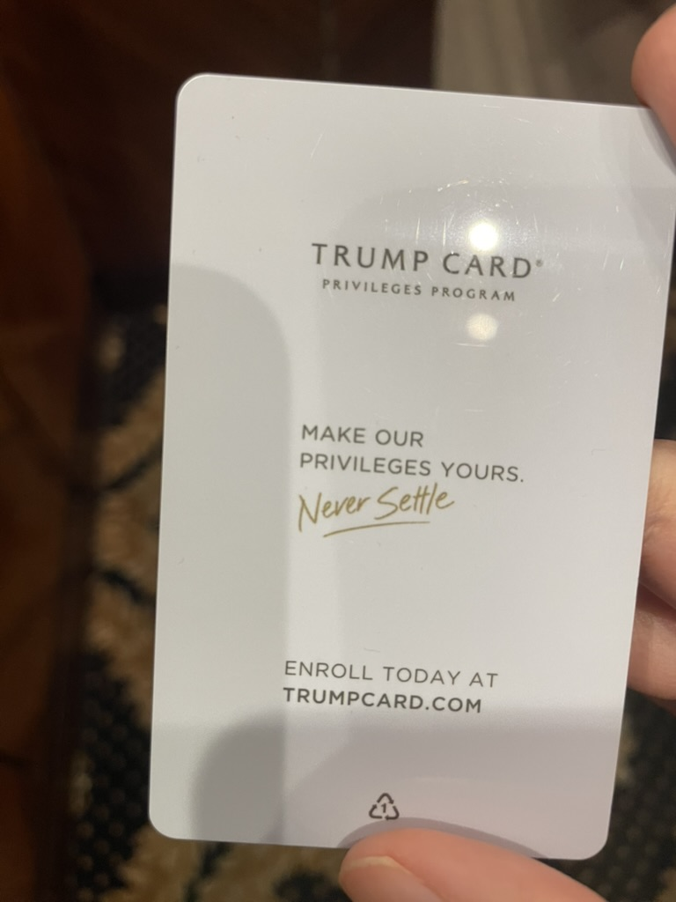

除了Trump我们还住了另一边的Luxor。Name after埃及金字塔，是个巨大的金字塔形状酒店。可以看出美国人确实不讲究风水，住在别人坟的复制品里实在是太神秘了……

我们当然也没住在坟里，是金字塔边上的另一栋建筑。这个建造得晚，更新一些，也没那么阴森。

Luxor比较经济适用，普通酒店水平，优点是金字塔内部有好几个show可看，还有快餐店可以大半夜加餐。

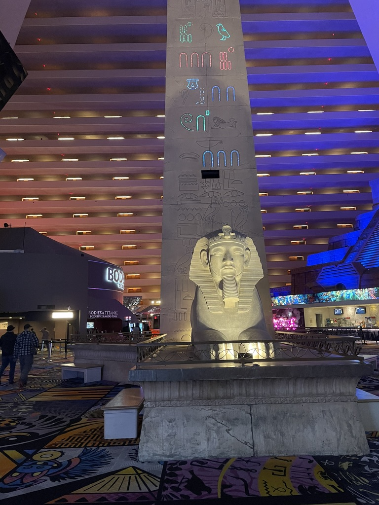 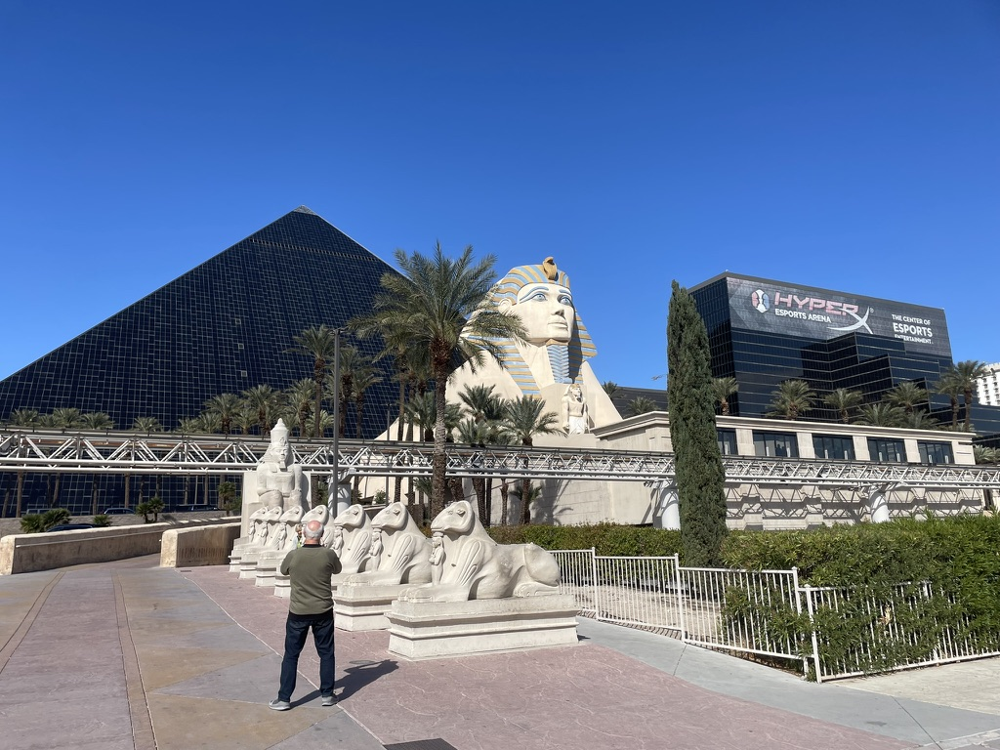

## 行

基本所有景点和酒店都在如图所示的这条路（Strip）上，只需要买一张3天的pass，就可以随便坐了。可以用纸质票也可以下载app `RideRTC` 直接apple pay，十分方便。这条线路上还有那个地标和outlets，进行了一些购买，个位数的Adidas和20块的converse，爽。

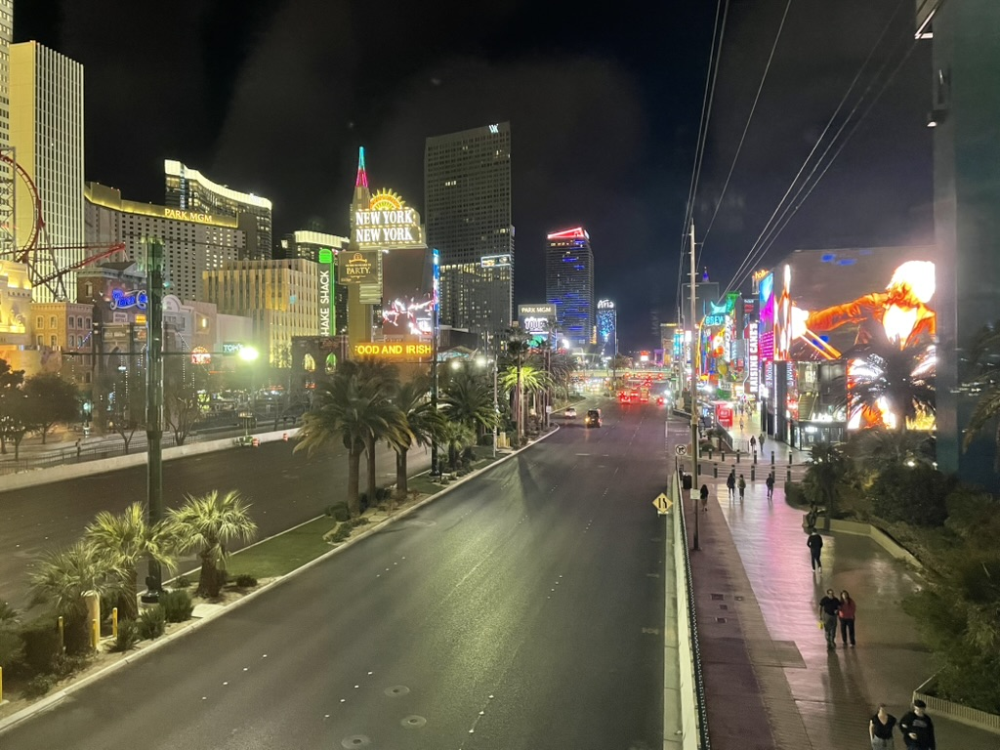 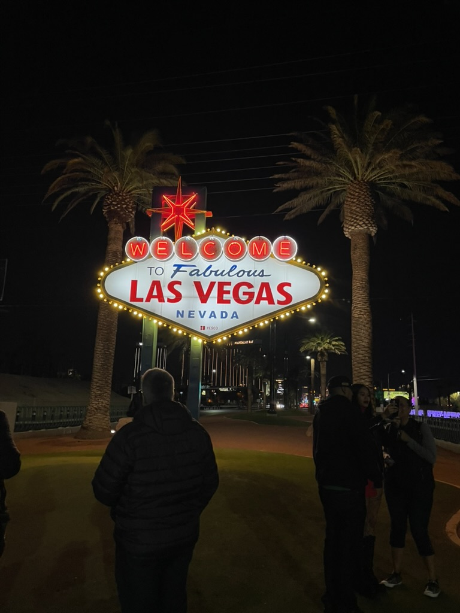

## 各种秀

从机场打车去酒店的时候，男友哥把坐了四小时飞机半死不活的我拍起来说，路边的广告牌全是各种各样的show的广告，看看有没有想看的。

我就随便一瞟，还真给我瞟到想看的了：蒂塔万提斯。

十分激动，这可是我还上小学和初中的时候就知道的明星（先不要深究我小时候怎么知道成人秀明星的）。她的名字早早印在了我的审美启蒙阶段，我对她营造出的那种极致的复古氛围充满好奇。没想到这么多年过去，竟然还能有机会现场看她的表演。一直以为Dita是属于“上一代人”的，就像我出生得太晚，错过了Britney Spears演唱会一样。但后来一查，发现Dita是1972年的，Britney才1981年，一时间有点语塞……

Anyway，我小时候对美式复古的了解主要来源于她（和打雷），怎么能不看！刚看见广告牌就打算买票了。我们坐在绿色的位置，如果钱够的话可以选红色的位置，表演主要在大舞台，过道和中间的小舞台也有一些。钱不够的话我们的位置性价比就很好，因为舞者上下场会从我们身后的通道走，能以超近距离看到他们的肌肉和服装，视觉冲击很强。

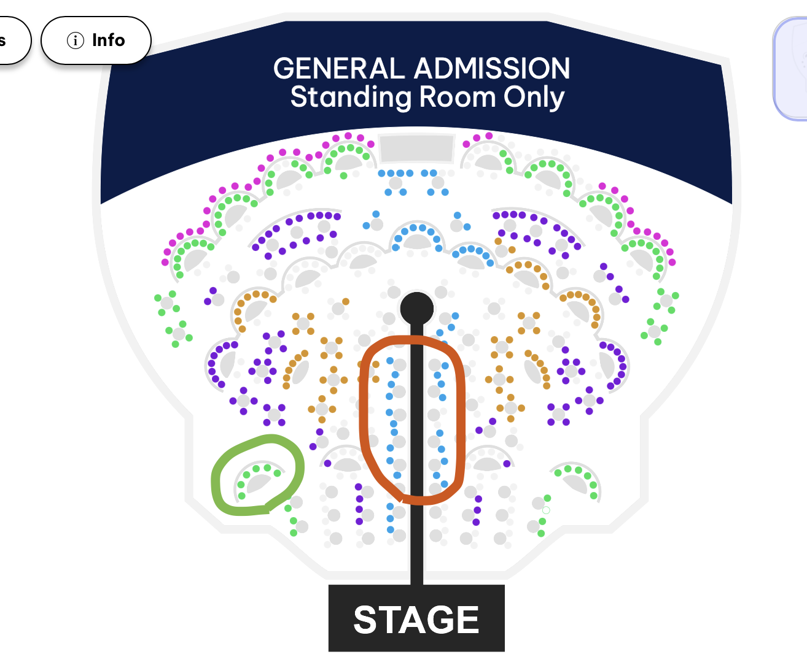
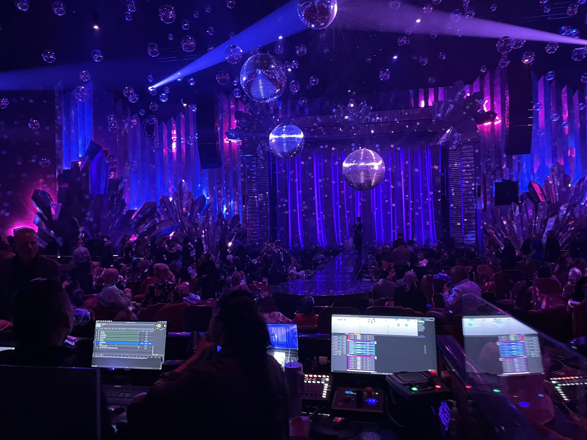

Dita本人已经53岁了，但身材依然完美，动作优雅得体，举手投足都透着一种自信和控制感。她的服装与舞美更是一绝，不是那种廉价的情趣内衣，而是经过精心设计的舞台服装：贴身、讲究、有细节、有质感。每一套都像是二次元画师搞OC：身材好，穿得少，元素多，很考究，颜色搭配和正负形都做得很好。

说是脱衣舞秀，其实尺度非常克制，不该露的都没露。整场表演更像是华丽、有节奏、有主题的视觉剧场。观众穿得也很正式，很多business casual，气氛也比较优雅。之前网上很多人对“疯马秀是高雅艺术”这句话嗤之以鼻，但如果疯马秀和Dita的秀是同一种质感的话，我觉得这句话倒也颇有道理。

让我印象很深的是，台上不只有女舞者，也有男性舞者，大家穿得不多，但跳得都很好，编舞、动作、节奏都非常专业。性感而不低俗，展示身体，也展示力量与控制力，是一种非常健康的性感。虽然我知道Dita为了这个身材拆过肋骨，和健康本身其实没什么关系，但视觉呈现确实让人觉得非常有魅力。

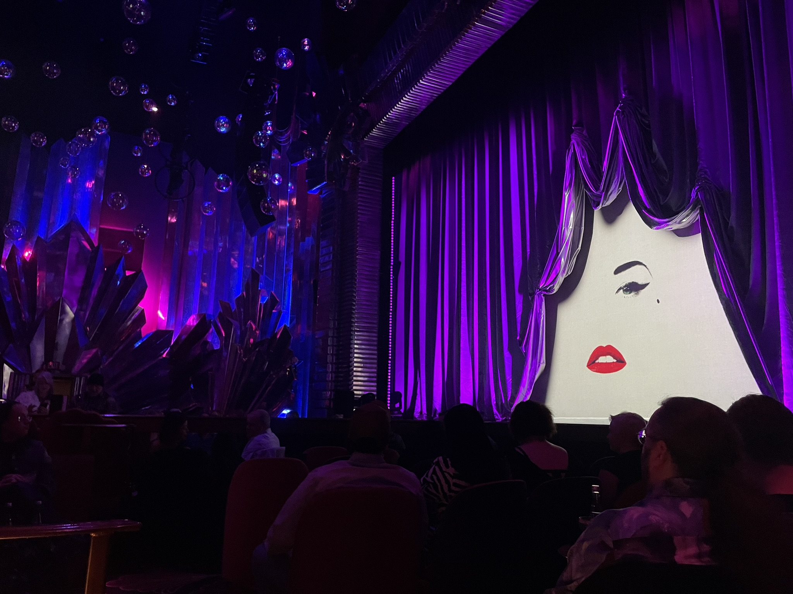

反面例子，就是我在Luxor看的，更下里巴人的，脱衣舞秀Fantasy。

Fantasy属于更加接地气的脱衣舞表演，票价也便宜很多。表演本身还算过得去，舞者都很美，但气氛完全不同——这场是真的脱着脱着就脱光了，观众席上坐着一排排中年男性，目光毫不掩饰，赤裸地凝视着台上年轻女性的身体。看到那样的眼神就让人十分愤怒。

节目没什么问题，但一旦放在这种观众群体和氛围里，就变得诡异、压抑，甚至有点悲哀。我坐在那里真的觉得自己做了个错误的决定，不该来看这一场。相比之下，Dita的秀让我觉得被尊重、被邀请进入一个美丽的幻想世界，而Fantasy却让我清醒地意识到自己是在消费他人身体的现实。

男朋友对这两场秀都没有特别兴趣，我反复说了好几次他才买票。看到我有点不对劲，凑过来问我还好吗。感觉就像狗狗闻到了人类情绪的变化（笑）我感到很懊悔！不该花这份钱的。不过来都来了，当作边上没人凑合看呗，手动屏蔽旁边的观众以后还是很好看的。身材很好，还有只通过丝带把自己在空中吊起来的舞者，十分恐怖的核心力量。

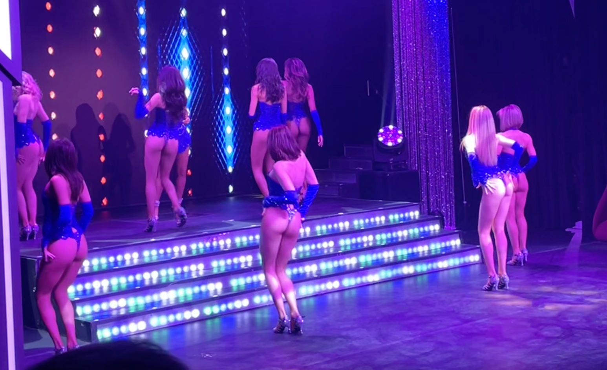

相比前面两个我一拍脑门买票的秀，太阳马戏团的KÀ是对象早早就安排好的。他做计划时就特意买了正中间第一排的票。

这个决定真的太对了。我们的位置离舞台超级近，能清楚地看到演员的每一个动作，甚至他们眼神的细微变化。小红书上有人说坐第一排要一直仰头脖子会酸，我完全没有这种感觉。第一排简直就是为这种表演量身定做的，必须要买……

我已经22了，不至于特别激动，但如果我十岁看到这种演出，估计能开心疯掉。KÀ非常适合带小孩来看，童话感和技术感融合得非常自然。太阳马戏团真的很会，他们没有一句台词，可以通过舞蹈、杂技、音乐和布景讲出一个完整的故事。

让我惊叹的是舞台技术，整个舞台可以旋转、翻转、升降，像变魔术一样，有一段整个地面竖起来变成悬崖，演员在上面打斗追逐，视觉冲击力很强。唯一的问题是我有点替他们恐高。全程没有安全绳，他们上上下下飞来飞去，看着就让我手心冒汗，好怕他们掉下去啊！

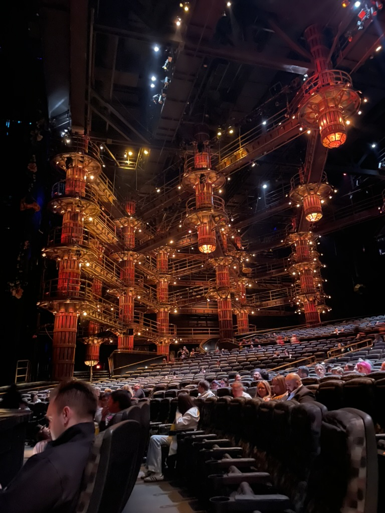

## 其他景点

### 可口可乐主题店

全是各种各样的周边，下图这些全都买了，很喜欢，唇膏味道也很还原，一些香精味（笑）

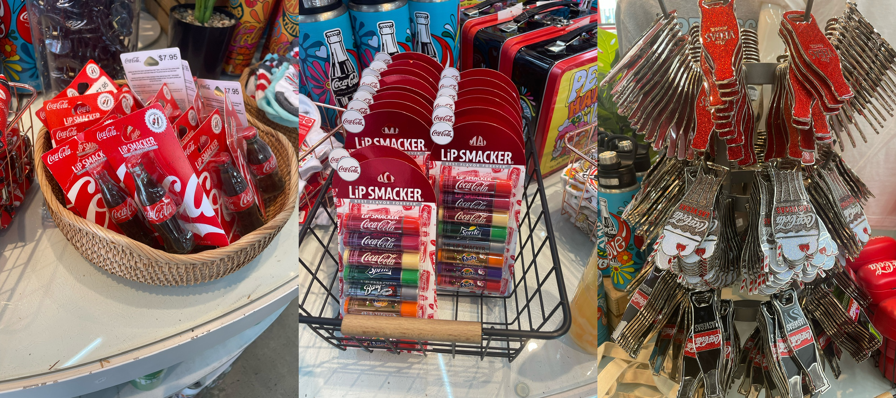

除此之外还有一些玩具、棒球高尔夫球、T恤，还有特殊包装的可乐。

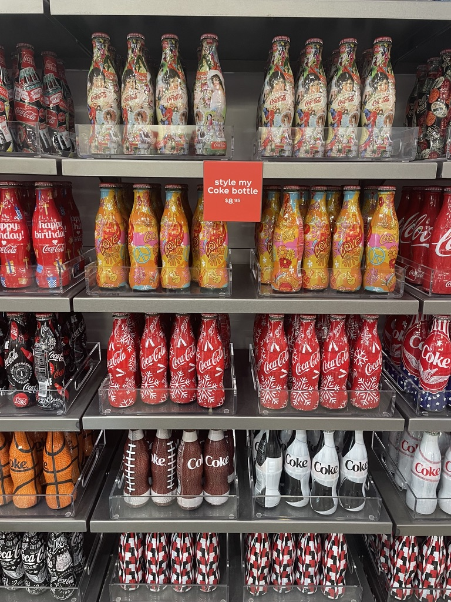 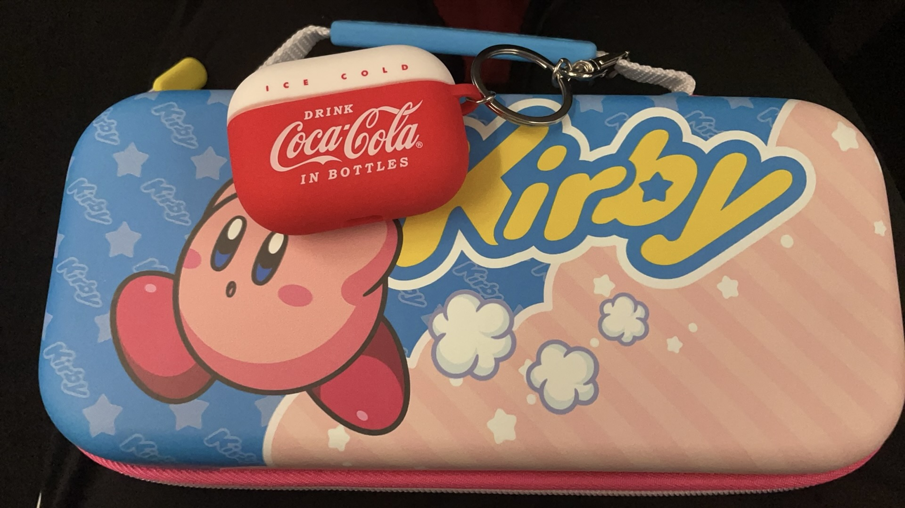

但我最喜欢的还是图上这个耳机壳，正缺耳机壳呢！在此之前我的AirPods裸奔了半年……男朋友也很喜欢，我们两个纷纷购买。

结账的时候还有小盲盒能拿，如果逛一圈没什么特别喜欢的，可以来个盲盒纪念一下。我们买了小号盲盒，获得了冰箱贴。可是我们本来也买了一个冰箱贴！只好留着送人

### 戈登拉姆齐小汉堡

暴躁老头在las vegas一共有四家店，两个汉堡，一个pub & grill，还有一个hells kitchen。后两个太贵了吃不起，主要尝了汉堡。

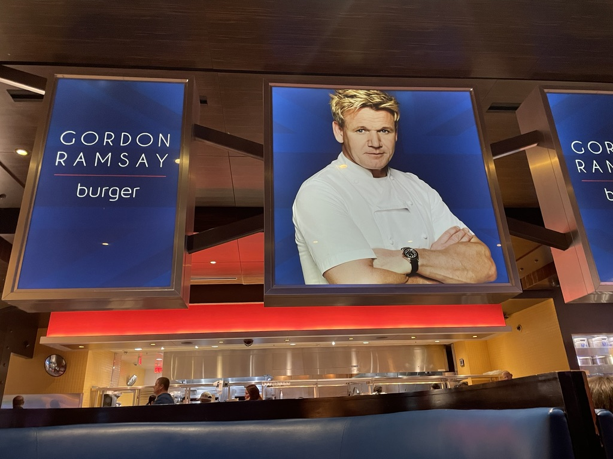

招牌是Hells Kitchen Burger，超级好吃，选了medium rare的肉，煎得恰到好处，十分嫩，汁水很多，只是描述一下我就又馋了……感觉比in n out和shake shack好吃一百倍！！

吃了地狱厨房burger和另一个burger（不记得是什么了 一个普通款 卖的不贵），吃完觉得魂牵梦绕还想再吃，于是第二天我们又去了另一家burger店，又点了地狱厨房burger和另一个burger（也不记得是什么了，可能是鹅肝或者蓝纹奶酪，只惦记地狱厨房了），吃得很爽！虽然作为汉堡确实有点贵，可是三个十块的shake shack和一个三十的地狱厨房，我选后者……

感觉有点好笑，之前去其他地方玩有吃很多人均一百的餐厅，也有吃米其林推荐和有星的，在我这里都是“好吃”，没有什么特别的评价。可是when it comes to 憨八嘎，我好像就能分辨出食物的好坏，感觉到这个比那个好吃，感觉到一分钱一分货。难道我是为了吃汉堡而生的？怎么只能尝出汉堡

### 摩天轮

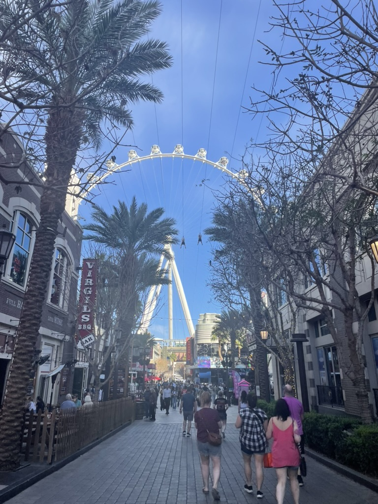 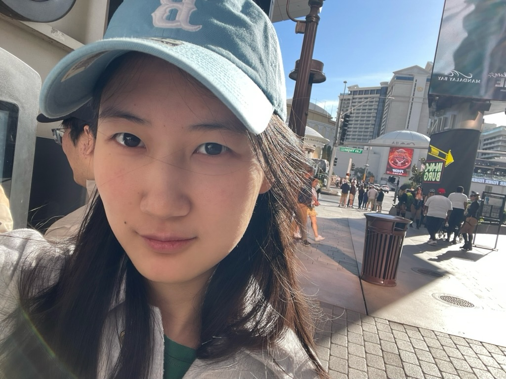

如左图所示，在strip上走着走着有一条通向摩天轮的路。这条路的入口有自助售票机，也就是右图本人的自拍背景！三十分钟29，还算可以接受。晚上五点以后贵十块，可能夕阳和夜景更漂亮吧。晚上还有秀，所以我们抓紧时间，下午四点多赶快买了票去看

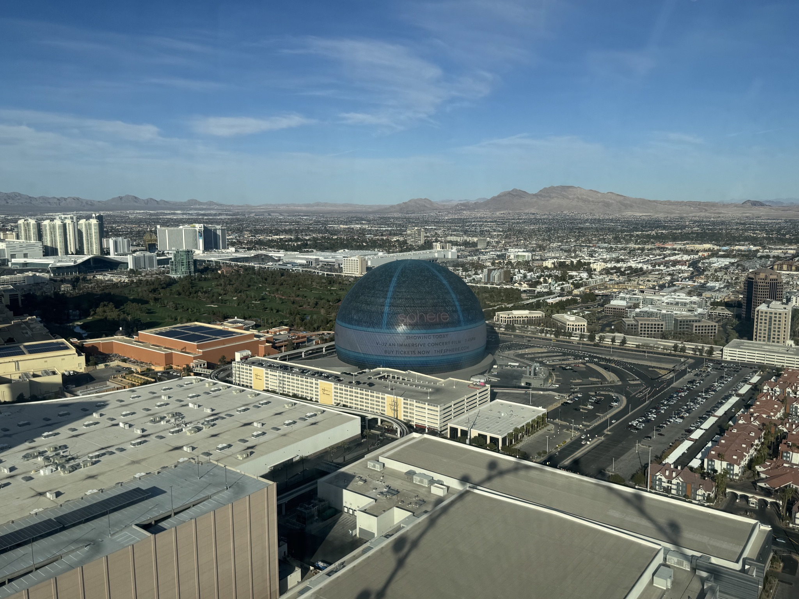

主要就是欣赏各大酒店和大球。其实也没什么特别的，只是本人从来没有坐过摩天轮所以来看看。之前一直恐高不愿意上去，现在才发现很稳，几乎感觉不到在动，原来一点也不可怕！

### 各个酒店

如果没住在luxor的话，这个金字塔还挺值得一逛的。Flamingo酒店的Flamingo也不错。Caesars和威尼斯人也有很大的商场，在里面看到了VIP参观顶奢，保安站在门口看门，好好笑哦

路上还有十分美丽的麦当劳，我们还把包落在里面了🫢还好晚上没有人
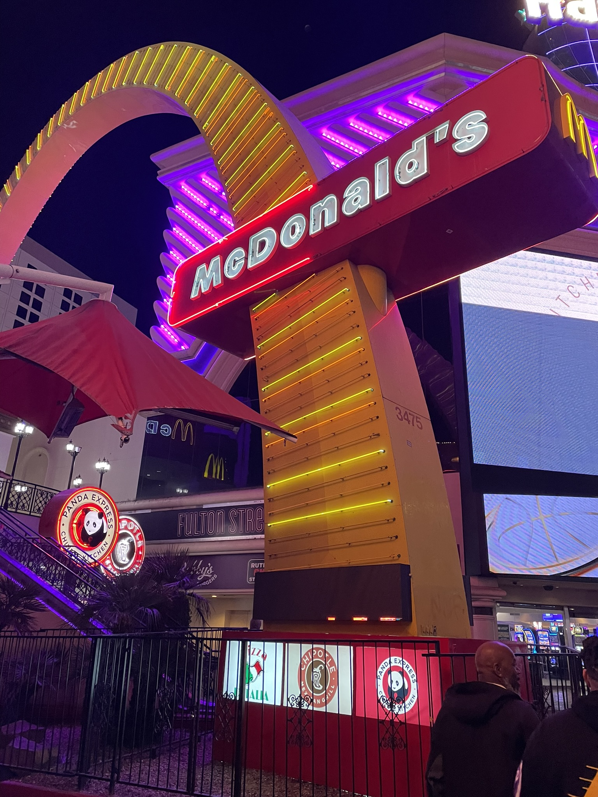

---
注1: 听课房，一种以超低价住酒店然后花一小时去听推销的营销方式。别管推销的人说得多么花里胡哨，只要记住千万别买，实在想买去买别人低价转让的二手。听一个小时如何拒绝他们也是难事，他们会说你用不了家里人也能用，我们以工作繁忙+父母工作需要上交护照无法出国拒绝了。
