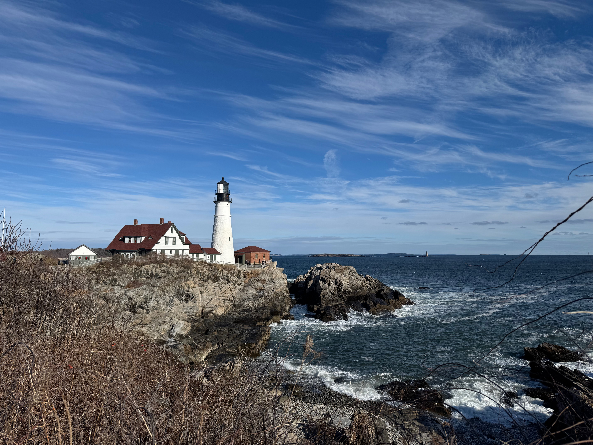
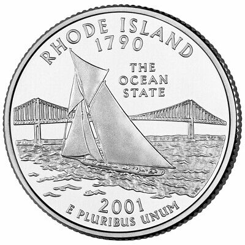
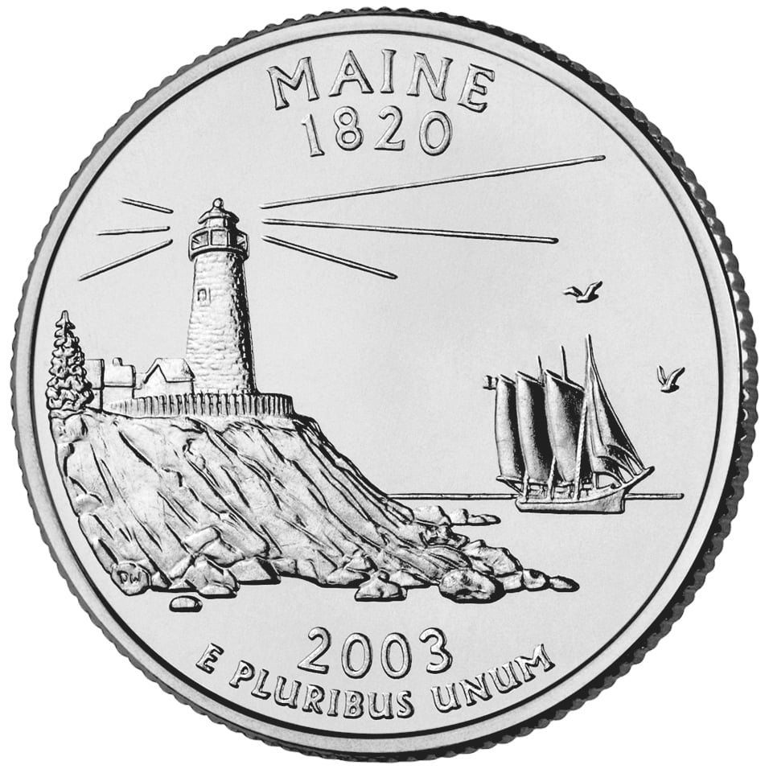
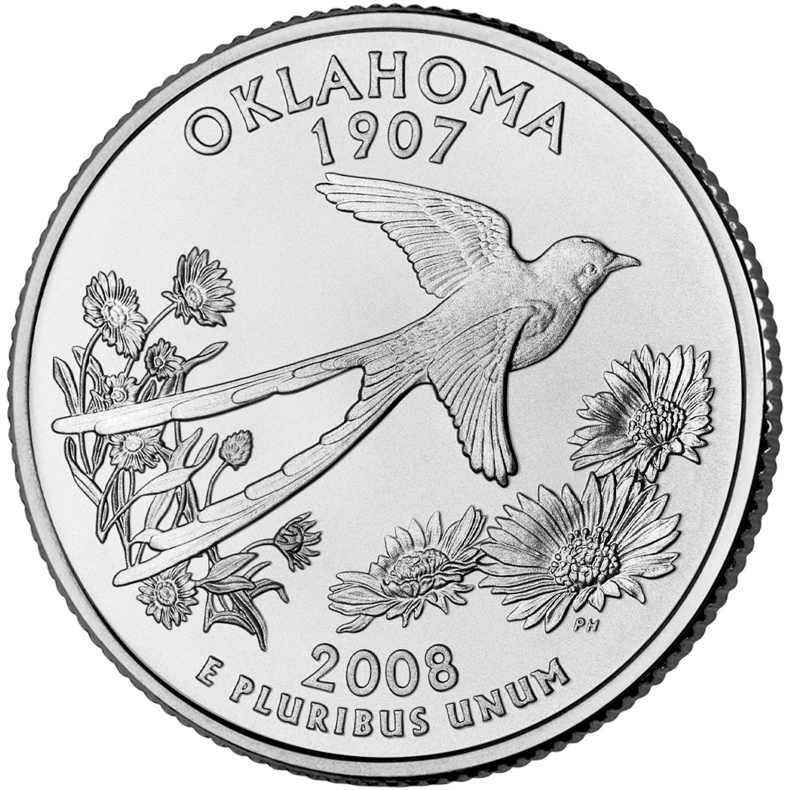

湾区像一个专门为社畜准备的生态缸，13到25度，日日复制粘贴，适宜上班。阳光是一种无孔不入的暴力，到了晚上七点，依然能穿透玻璃，在皮肤上焊上它的印记，留下一片灼烧感。

完美的秩序会催生对混乱的渴望。我的身体里开始出现一片不存在的飞地，那里的气温是负数，天色是铅灰，随时都会下大雪。我想起了波特兰，那个比波士顿更北的坐标。

去年圣诞节的时候，明知那边是零下十几度的温度，还是毅然决然地去玩了。穿上了最厚的衣服，戴上了丑但保暖的毛线帽，在羽绒服外面系好围巾避免漏风，我们就这样裹成球坐上了火车。

下车后我有一些轻微的惊讶。站台小小的，不像波士顿直接在TD Garden下建立的大站台，也不像Providence有个气派的候车大厅，更像是国内的某个小县城的火车站。

灯塔就矗立在那里，和无数宣传册里拍得一样。寒风凛冽，把我的脸颊吹成一种僵硬的红，把他的脸色塑造成另一种铁青的黑。我们是风的两种作品。我们在海边举着手机自拍，就在这片静默的调色盘中，一团饱和度过高的明黄出现在视野里——一位穿着波士顿棕熊队队服的一米九壮汉，像从另一个维度的体育酒吧被抛掷到这片萧瑟中。他用一种能融化冰雪的热情，夺过我们的手机，要为我们定格这个瞬间。我们开心地道谢，接过手机一看，他把我俩拍得像被压扁的小矮人。

灯塔脚下有一个投币望远镜。我自然是没有硬币的，男友翻遍口袋，找到一枚25cent投进去，却被机器无情地卡住，不上不下。

我抬头望向望远镜本该对准的方向，不过是海滩和石崖，并没什么非看不可的秘密。

“我们走吧，拿不出来就算了。”我对他说。

他不这样想，换的硬币都是4的倍数，洗衣房也需要4的倍数个硬币，他十分珍惜每一个quarter。他一只手摘下手套，另一只手摇晃、敲打那台冰冷的机器，我站在灯塔投下的巨大阴影里，感觉自己像一个时钟的指针，在原地被海风推着一格一格地走。

硬币“当啷”一声被解救出来时，我们像打赢了一场仗。我第一次仔细看美国的硬币，上面的图案竟意外地精致。后来回酒店，我翻出他所有的硬币，把罗德岛和缅因州的图案据为己有，正好也是我们一起旅游过的地方。被投币望远镜抢走不行，但被我私藏天经地义。

  

我们接着在灯塔周围小小地走了几步。黄色的枯枝和海滩上的黑色礁石塑造出一些萧瑟的氛围。这景象其实比夏天拍的宣传图好看。灯塔是这片大自然里孤独的建筑，被绿色植被包围的话太生机勃勃了。这种世界归于静止的氛围恰到好处。

水也在房檐上静止了。手臂长的冰溜子。好像回到了上小学之前，我趴在车下面掰这些小冰柱的时候。我们俩一人掰了一片，开始击剑。我们心中像动物的那部分开始觉醒，无法拒绝一根圆形的棍，尤其还是冰做的。我们笨拙地击剑，冰柱清脆地碰撞，碎裂，在冬日干燥的空气里，笑声传得很远。直到玩腻了，才心满意足地把整个屋檐的冰溜子全部处决，然后恋恋不舍地离开。

脚下的土路为什么亮晶晶的，在阳光下十分晃眼？我蹲下捡起一片。是云母。男友在我耳边说着这里的地质构成，猜测是自然形成还是装修废料，我左耳朵进右耳朵出，满心满眼都是这些被我们踩在脚下的、破碎的星星。我收集了一小撮最大片的，用纸巾包好当作纪念品带回家。

回程的uber上，副驾驶是一只大型犬。司机好像说了什么不得不带着它的理由，我不是很在乎，光顾着兴奋了，连说没有关系、我喜欢狗。品种也没记住，只记得黑色立耳，看起来很帅，实际上是坐在副驾一动不动直视前方的很乖的狗。它能看懂路况吗？好像是比我更称职的副驾驶。通常情况下我坐副驾只是为了不晕车。司机真的很爱这只狗，至于对狗过敏的人怎么办？我没想明白这件事，问了几个美国人，也没得到回答，要不说没想过，要不说吃过敏药。大家这么爱狗，这好像都不是个问题。

---

寒冷把我们驱赶进了室内，一家评分不错的小餐厅。

首先是一人一碗Clam Chowder，汤很稠，几乎是用勺子挖起来的。奶油浓汤和蛤蜊肉，没什么技巧，就是单纯的、实在的、能让你迅速活过来的热量。窗外是漆黑的冬夜，窗内是这两碗冒着热气的白色糊状物，我们埋头吃着，感觉身体里冻僵的部分正在一寸寸解冻。

生蚝被端上来，躺在一大盘碎冰上，像刚从海里捞出来的石头。它们闻起来就是港口的味道，那股咸腥的海风味。挤一点柠檬汁，滴一滴红色的辣酱，然后把这片滑溜溜的软肉吞进喉咙。冰凉的蚝肉带着一丝甜味，尝起来就像是刚才吹在脸上的，那片广阔又冰冷的海风。

硬菜是龙虾卷。它被装在那种红色格子的餐纸上，看起来有点傻。普通的热狗面包，从侧面剖开，用黄油煎了一下。里面的龙虾肉大块大块地堆在一起，用最少的蛋黄酱拌着，几乎要掉出来。根本没什么优雅的吃法，我们像啃玉米一样举着它，肉和酱汁沾在嘴角和手上。在那几分钟里，我们没空说话，只是专注地解决掉手里这个塞满了整片海洋的馈赠。

感谢大海与当地人民发明了如此美味的生物和做法，ramen。

---

夜晚，我们去港口散步。空气里弥漫着大海潮湿的咸味和一丝若有若无的鱼腥。一座鱼类加工厂在不远处嗡嗡作响，昏黄的路灯把我们的影子拉得很长。路的右侧，是一座水泥楼宇般的立体停车场，冷白色的灯光让每一辆车都呈现出一种标本般的静止。

我们并肩走着，没有说话。前方是深不见底的漆黑水域，只有远处零星的灯火。他握住我的手，裹住我冰凉的指尖。世界只剩下我们脚下这一小片被昏黄灯光照亮的土地，和眼前那片广袤又神秘的黑暗。

这座城市干净、整洁，以渔业为傲，处处透着一股秩序井然的发达。可惜了，如果再破败一点，再混乱一点，就真有几分极乐迪斯科的味道了。

游戏的核心是一种寻找，寻找身份，寻找过去和未来，在一片废墟里寻找逻辑。

而我们，又在寻找什么？或许什么都没找。只是并肩走着，让港口的风灌满我们羽绒服的缝隙，感受着某种巨大而无声的事物——码头，海洋，黑夜——从我们身边流过。在这有序又荒芜的游戏场景里，两个人共享着同一段沉默，我们依偎着对抗港口凛冽的寒风。