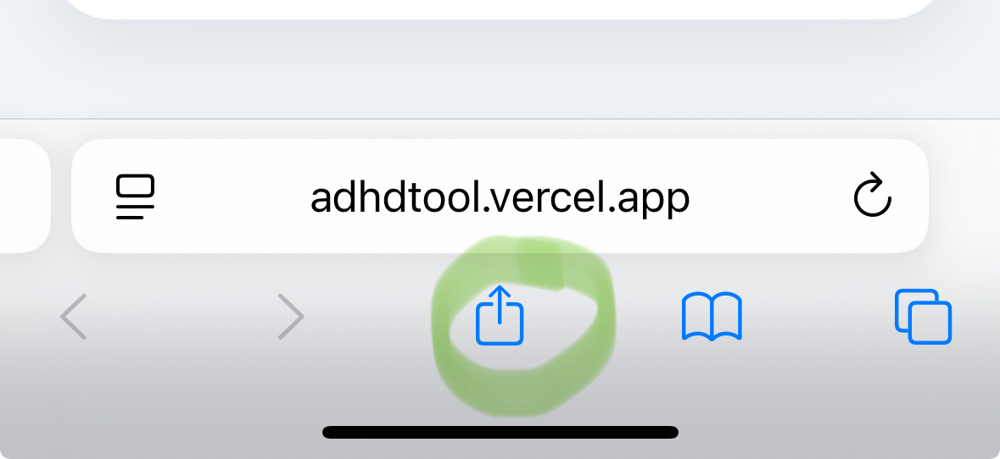
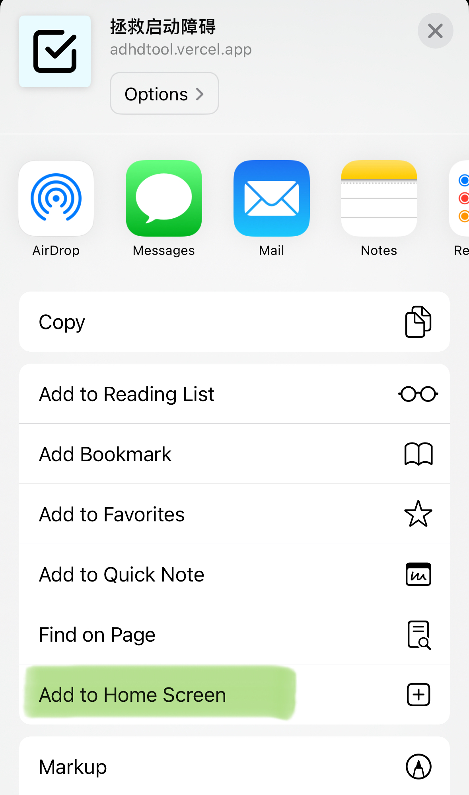

还记得本科的时候，凌晨三点，我们宿舍依旧灯火通明，还有两个人坐在懒人沙发上玩手机。

其中一个人是我。并非故意不想睡，只是我还没刷牙。哦，室友也没刷。

“去刷牙”，一个三分钟就能搞定的事。大脑里的指令清晰得不能再清晰，但身体就是无法执行。我们俩就这么僵持着，像在比谁更能耗。最后总得有一个人先鼓起勇气，站起来，打破僵局，另一个人才像被赦免了一样，跟着动起来。

我们后来把这种现象归结为“启动障碍”。这个词听起来很学术，但解释起来很简单：我的脑子知道该做什么，但它就是无法开始。

这种感觉，我想每个adhd都懂。它不仅仅发生在“写我的期末大作业”这种大事上，更频繁地出现在“洗个碗”、“回一封邮件”，甚至“去刷牙”这样的小事上。

我四处求医问药，看了很多和拖延症、和启动障碍作斗争的经验分享。其中最有名的那个，就是“把大任务拆分成小任务”。

道理我都懂。可悖论在于，当我的大脑连“开始刷牙”这个主程序都调用不出来的时候，它又怎么可能有力气去运行“把刷牙分解”这个子程序呢？这就像一个卡死的电脑，你点什么它都没反应。

我知道我需要一个台阶，一个微不足道、小到几乎可以忽略不计的台阶，好让我能先把脚抬起来。

但我自己造不出那个台阶。

所以我写了一个小工具。一个非常简单的网页。

它存在的唯一目的，就是代替我的大脑，来做“任务分解”这件最简单也最困难的事。

在我输入一个让我动弹不得的任务，比如“洗澡”之后，它会代替我那个罢工的大脑，把它拆成一堆我几乎不用思考就能完成的小事。

> 走进浴室。
> 
> 打开花洒。
> 
> 脱衣服。
> 
> 站进去。

---

推荐的用法是加入到浏览器书签，或者是直接添加到桌面。

 

这个小工具没有创造奇迹。它只是在我大脑罢工的时候，从外部给了我一个最最基础的行动指令。它把那堵无形的墙，变成了一系列我几乎不用思考就能迈过去的小石子。

每完成一步，都能给我带来一点点微不足道的正反馈。

它不能解决所有问题，但也许，它能帮你迈出第一步。

[ADHD tool](https://adhdtool.vercel.app)