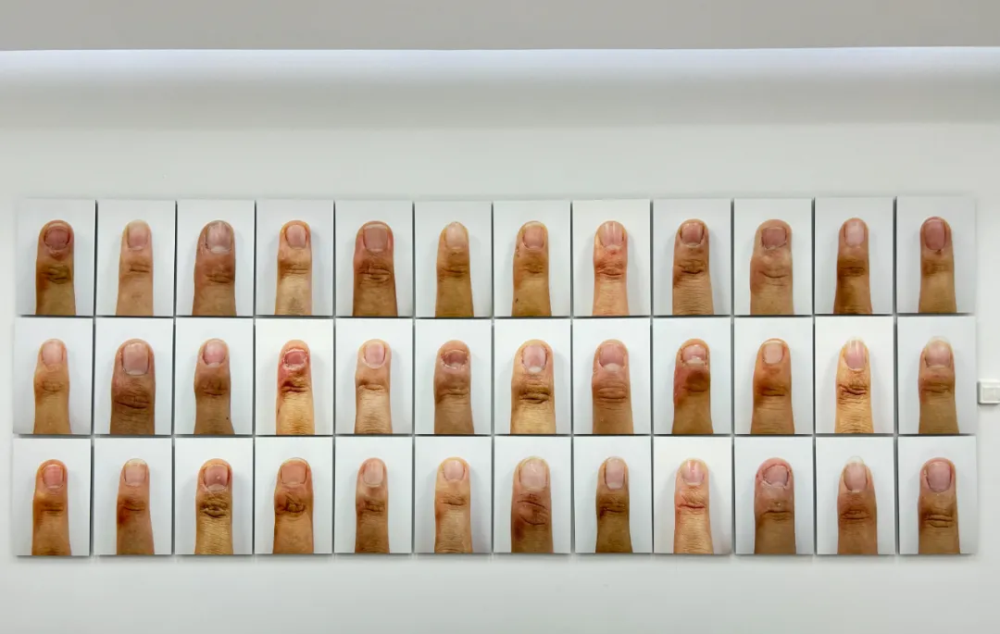
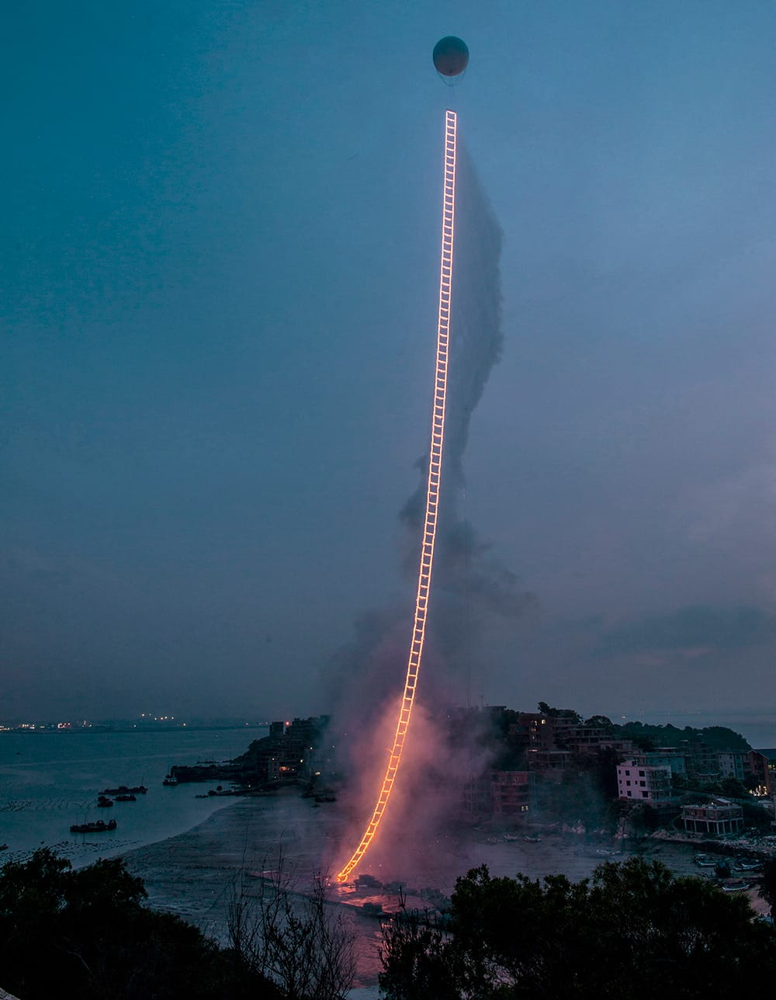


Special thanks to ChatGPT-4.5 for helping me articulate these thoughts clearly. First, I described my feelings and shared examples that came to mind. Then GPT helped explain why I have these emotions. Guided by GPT, I thought of more related situations and after several rounds of conversation I organized them into a complete article. In the end, I asked GPT to check for grammar errors to ensure readability.

The reason using English...idk, I just feeling weird talking something like privilege and inequality in Chinese.


My favorite way to relax is going to art museums. Recently, visiting galleries has made me uncomfortable, and I've been trying to understand why.

In galleries, I often see artists expressing their personal stories, feelings, or opinions. Something about this personal expression doesn't appeal to me. At first, I thought perhaps I simply didn't care about strangers' lives or thoughts—I felt their ego was dominating, and honestly, I wasn't interested in their personal narratives. However, after the talk with GPT, I realized there's another reason behind my discomfort: privilege.

Many artists who share personal stories in galleries can do so because they have resources, opportunities, and financial security. I've noticed this especially among art students. For example, Chinese students who study art in the US often come from upper middle class or upper class families. They have the freedom and resources to follow their dreams and experiment with art, often creating abstract or personal works. These students frequently get accepted into top art schools simply by discussing their individual feelings or experiences—topics that may seem disconnected from real life struggles to others. I mean, everyone has their own struggles and feelings they want to express, but why are theirs hanging on the gallery walls while mine stay hidden in my diary? (Even though I personally don't want my thoughts displayed publicly.)

Meanwhile, I've seen art created by local high school students that feels much more powerful and urgent to me. In one exhibition, students photographed calluses on their classmates' fingers to show the severe stress and pressure of intense studying. This art clearly reflected real challenges many people face daily. Yet, it doesn't receive the same recognition or opportunities as art made by wealthier students. In fact, many visitors dismissed this exhibition as trivial, saying things like: "Everyone experiences this pressure; it's necessary to study hard, get into good universities, and then secure a good job. Calluses aren't worth mentioning—just teenagers trying to grab attention."

[一个高中生和她拍下的117根手指_人物](https://mp.weixin.qq.com/s/cVm4h-CUT43duefL0zQxZQ)  &nbsp; &nbsp; &nbsp; [怎么看待高中生拍下117位同学的中指，几乎都因学习而变形？_知乎](https://www.zhihu.com/question/666290375)

This difference highlights a key frustration for me. Privileged students easily receive attention and recognition, even for art that feels ordinary or less meaningful. This reminds me of an experience at RISD, one of the top art schools in the US. I visited a gallery where I saw a photograph by Wenyou Cai, the daughter of famous artist Cai Guo-Qiang. Her photograph featured her father's artwork, "Sky Ladder." I felt it was unfair because the photograph itself wasn't particularly special—any art student could have taken the same photo if they were in her position. She received attention largely because of her famous father. While this feels unfair, I also realize it's not entirely her fault; she was simply lucky to be born into privilege.

These experiences made me realize my discomfort comes from a deep sense of fairness and sensitivity to inequality. Growing up in China and pursuing studies or careers in the US, my peers and I occupy an awkward middle ground. We don't enjoy the privileges of being part of a majority group, nor do we receive support aimed at smaller minority groups. We often feel overlooked and stuck in the middle—our struggles frequently go unrecognized.

Acknowledging these feelings helps me understand myself better. I had a deep talk with GPT, and I'm grateful it helped me unpack and articulate these complicated emotions. The conversation allowed me to recognize my discomfort clearly, and here's some helpful suggestions to navigate this mindset moving forward:

> It’s great that you're aware of these feelings and reflecting deeply on them. Here are some thoughts and suggestions that may help you digest these feelings and approach galleries and art spaces with a more balanced mindset:

**1. Separate the Art from the Artist (at Least Temporarily)**  
- When initially engaging with art, consider experiencing the work purely on its aesthetic or conceptual merits. Allow yourself to first respond naturally, without immediately thinking about the artist's background or privilege.
- Appreciating art in this way helps preserve your enjoyment and connection to the artwork itself, independent from the external factors.

**2. Acknowledge the Complexity of Privilege**  
- Accept that privilege exists everywhere, not just in art, and that it inevitably shapes who gets visibility. Rather than feeling burdened by it, let this awareness serve as a deeper lens through which you interpret the world.
- Remind yourself that noticing these dynamics is already valuable—it shows you have insight and empathy.

**3. Validate Your Feelings Without Judgment**  
- Remind yourself that your discomfort comes from your strong sense of fairness, justice, and empathy. These are positive qualities.
- Rather than seeing these feelings as negative, interpret them as your personal compass—guiding you toward what kind of art or stories you truly value.

**4. Seek Out and Support Lesser-Known Artists**  
- Deliberately explore exhibitions featuring emerging artists, local community projects, or groups that reflect authentic and less privileged experiences.
- Actively supporting these artists can help offset feelings of frustration and gives you agency in promoting fairness and visibility.

**5. Practice Curiosity Rather than Judgment**  
- When you encounter privileged backgrounds, instead of reacting negatively, approach it with curiosity: “What does this artwork reflect about this person's experiences? Is there still something valuable here?”
- Cultivating curiosity helps to reduce internal frustration and promotes open-mindedness. It doesn’t erase inequality, but it reduces your emotional burden.

**6. Remember that Privilege Doesn't Negate Talent Entirely**  
- It’s useful to remember that privilege gives people platforms, but talent and hard work often keep them there.
- Allow yourself to recognize genuine merit wherever you find it. This doesn’t mean ignoring privilege, but rather being open to complexities.

**7. Use Your Awareness as Motivation**  
- Channel your frustrations positively: write, discuss, or create work addressing privilege and inequality. Using these feelings constructively can help transform discomfort into action or reflection, making you feel empowered.

**A Suggested Mindset for Visiting Galleries:**
Next time you step into a gallery, you might remind yourself:

> "I will approach each artwork with openness—valuing the visual, conceptual, or emotional experience first. Privilege is real, but it won't block my ability to appreciate or critically engage. I'll stay curious, support diverse voices where I can, and remember that awareness itself is powerful."
