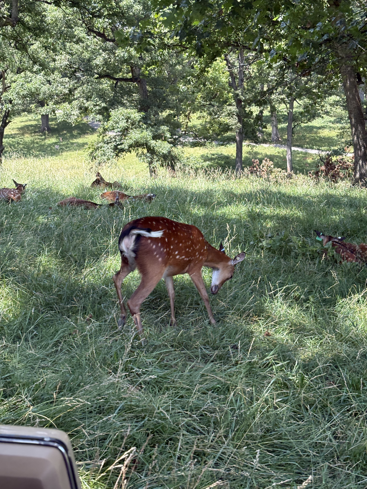
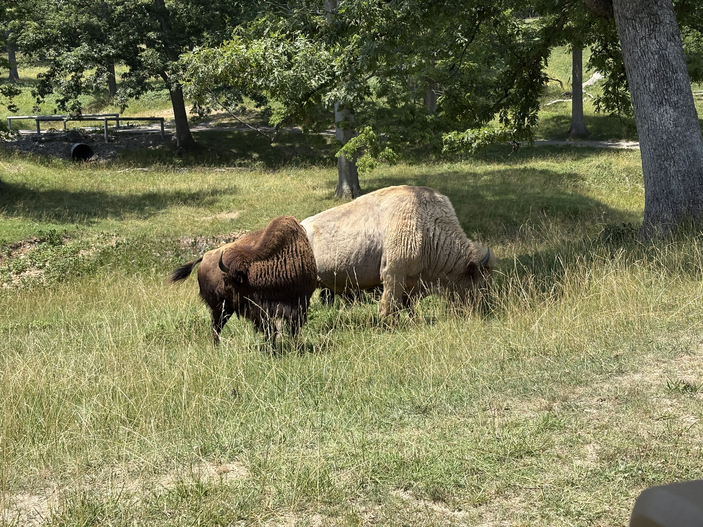
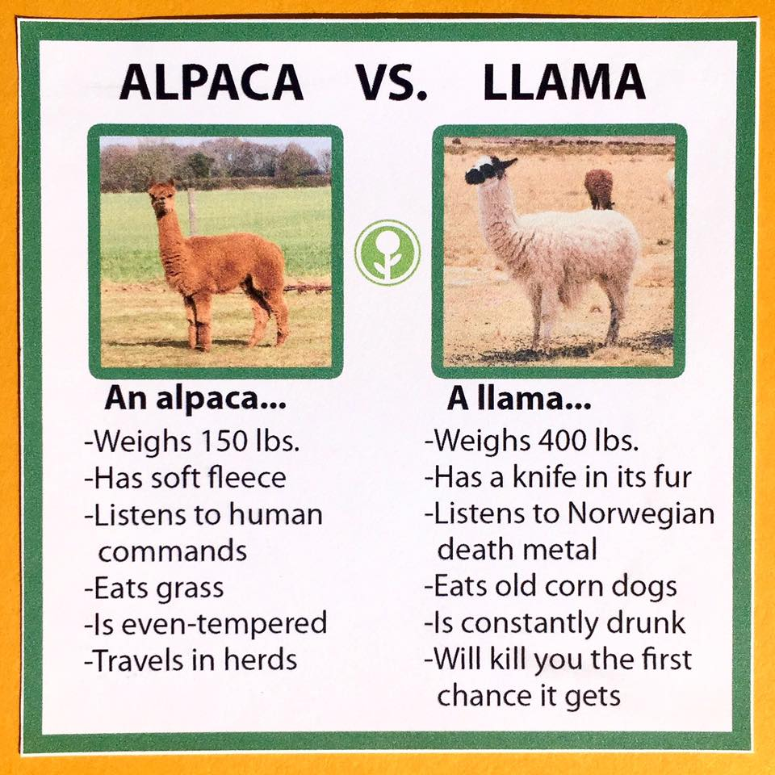
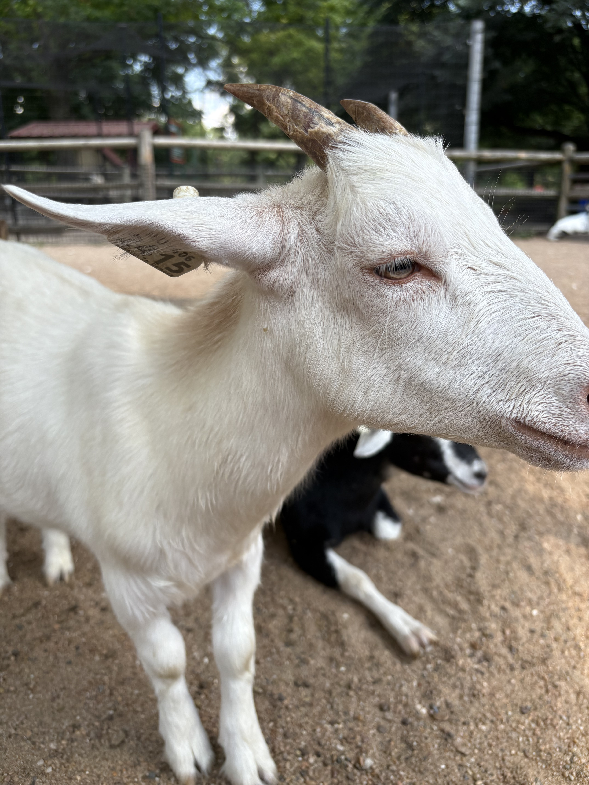
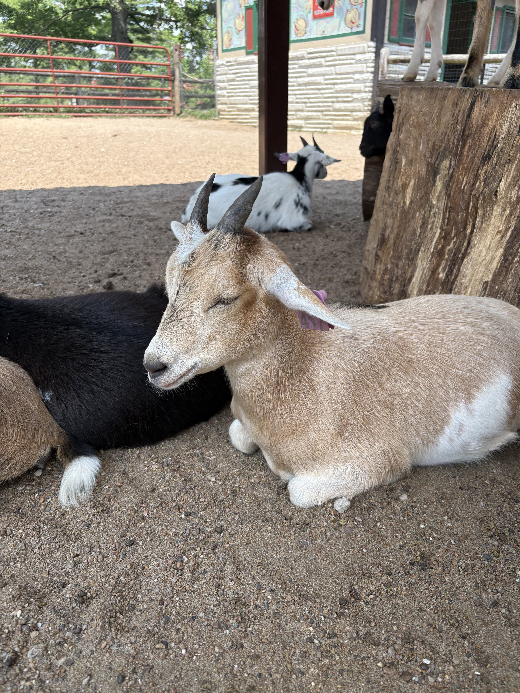
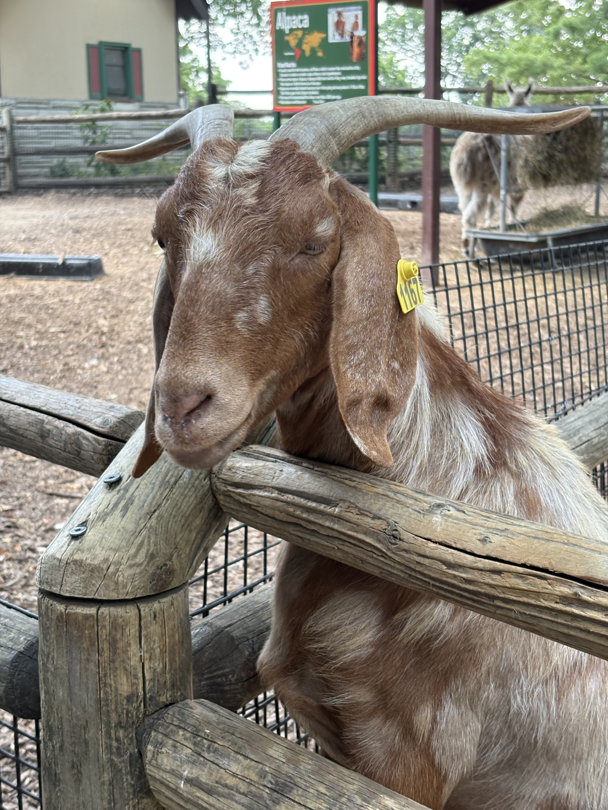
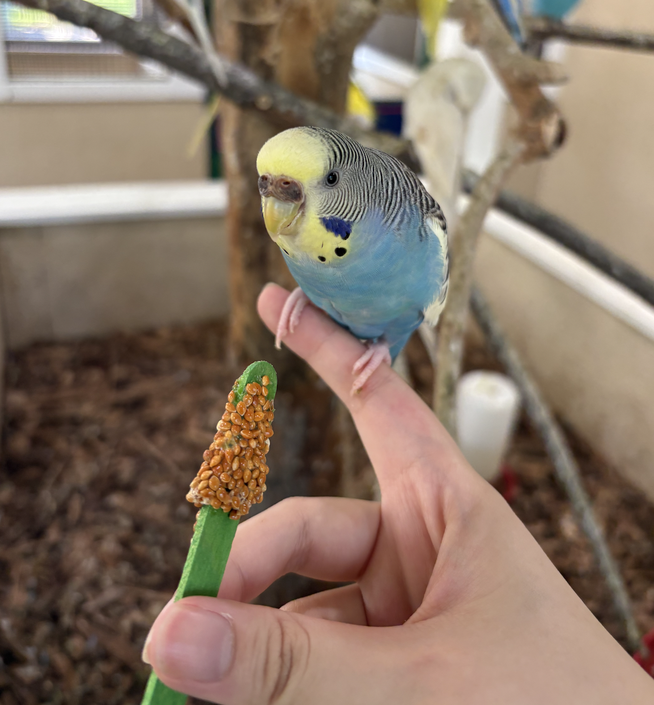

独立日假期，在浏览了廉航机票和周边三百公里内的景点，发现所有地方都溢价过多谁去谁是冤大头之后，我决定去农场补充一些毛茸茸能量。

据可靠消息也就是男友所说，此处的小羊亲人又可爱，和小狗相似的体型和性格，和狗咖相比不要钱随便摸，实在是一个好去处。

这家农场的经营理念非常可持续，门票免费，停车收费。当然，我们本来也没车，我们如闪电般地于出发前一晚在二手群迅速购买了一辆自行车，制定了地铁+骑行的绿色出行方案。

事实证明，我们新淘来的自行车，与其说是交通工具，不如说是一件自带负重功能的移动健身器材。它用钢铁般的意志顽强地拒绝前进，我无比想念国内的共享单车……而对象的公路车轮子太窄我并不会骑，我就这么在三十多度的烈日下痛苦地骑着一个铁块。

最后我还是向现实低头，召唤了一辆出租车。当我在游客中心下车，穿过一条波光粼粼的小河，终于坐上农场的摆渡车时，我感觉世界都明亮了。

  

摆渡车缓缓驶入一片茂密的树林，动物们的世界终于在眼前展开。有眼神呆萌的普通牛，有看起来就很北美的野牛，甚至还有——牦牛？！我很震惊。看着它那一身厚重的长毛，我陷入了沉思：在我这个光溜溜的灵长类都受不了的夏天，这位来自青藏高原的壮士，是如何思考它的牛生，又是如何忍受这生命中无法承受之热的？

车子继续前行，我们又遇到了几群鹿。它们大部分还没长出华丽的角，只有短短的角。甚至还有梅花鹿，见到老乡十分开心，就是感觉老乡不认识我。农场工作人员说长得很高的野草可以掩护它们不被发现，会让它们有更多安全感。我感到很神奇，鹿明明是棕色的，草是绿色，这不是一下就找到了？

直到开车路过鹿所在的区域，草长得很长，鹿往草丛里一趴，就瞬间与枯黄的草根和斑驳的光影融为一体。如果食肉动物和我一样近视的话，可能会饿死。

还有其他的一些动物，比如羊驼。之前从来没有思考过，工作人员一说我才意识到alpaca和llama是两种动物。它们体型不一样，脸也不太一样。

绕了一圈，我们到了农场的中心。一下车就是喂小羊喝奶的地方。我开心地买了两瓶羊奶，直奔围栏里的小羊。

羊比我想象得热情太多，我还没来得及摆好姿势就冲上来使劲扒拉我，等我回过神来已经有好几只羊形挂件了，还有一只已经咬住了奶瓶开始喝。男友也是第一次来喂小羊，奶没给它们喝多少，大喊“别吃我的裤子！”的声音响彻农场。好在我的裤子比较紧，羊们无从下口。好热情，好可爱，如同我在tiktok刷到的宠物羊一样，像小狗。

本着雨露均沾的精神，一瓶奶塞进了大概十只羊嘴里，我还顺便把男友那瓶也喂了，小东西们力气真大啊！本来还打算喂完给它们梳毛的，可是它们已经建立了人类=食物的条件反射，不顾一切地冲过来。难道农场饿着它们了？我不禁想起之前看过的梗……为什么没人养羊当宠物，因为养过羊的都能体会到你什么都没做它非要顶你的无助。

走了两步看到了刚才那些可爱小羊的成年版本。呃……赏味期堪比比格犬，只有前三个月。小时候是可爱的宠物，长大了是优秀的蛋白质。

    

但是牛是真的从小到大都很可爱，眉清目秀的，我想起老头种地综艺，克拉克森给一头最好看的小牛起名叫Pepper，大家都喜欢她。我在这里看到的牛也一样可爱。真是见其生不忍视其死，闻其声不忍食其肉啊！于是我们中午在汉堡和热狗中选择了炸鸡。

农场是百威赞助的，所以每人还可以免费尝一杯啤酒。我选了mango cart，芒果味很足，没什么酒味，对于我这种不喜欢啤酒味的人来说实在是很好的酒！加入我可能会买的酒的清单。

还有一间小房子，里面有上百只虎皮鹦鹉。虎皮真的是好吵啊！但是因为身价低，脑袋笨笨的，经常被无良商家当玩具。看到这些鸟在这里养得圆滚滚油亮亮，心里暖暖的。

农场里还有动物表演环节。一开始我有点犹豫，担心这些表演背后会不会有一些有违动物天性的训练。

事实证明，我的担心纯属多余。第一位登场的员工没有表演节目，表演了赖着不走。原本的节目是豪猪绕杆，可是它对饲养员零食的引诱无动于衷，完全无视了那些作为道具的杆子。最终，饲养员放弃了S形走位才艺展示，只是让它跟着零食绕场一周，然后退场。这可能是我见过最闹着玩的动物表演了，我感觉好像是我在表演鼓掌给它看给它丰容呢。

下一位员工是猪，和豪猪一比，它简直是海绵宝宝级别的热爱工作。它不仅出色地完成了绕杆任务，甚至还表演了扔球捡球，丝毫不逊色各种寻回犬。我还以为猪不运动呢，原来比我勤奋多了。

我本来以为这就是给小孩的过家家表演，直到出现了金刚鹦鹉。它表演的是……十以内数学运算。

它会加减法，甚至还有乘法！饲养员邀请观众席的小朋友随便出题，鹦鹉会飞快地倒腾双脚径直走到对应的数字板前，用喙推倒。我十分震惊，完成这项任务不仅需要会数学，还需要听得懂人话，还需要分得清数字！难怪不推荐一般人养大型鹦鹉，这么聪明的鸟得多难养啊。请看鹦鹉算乘法的视频：




