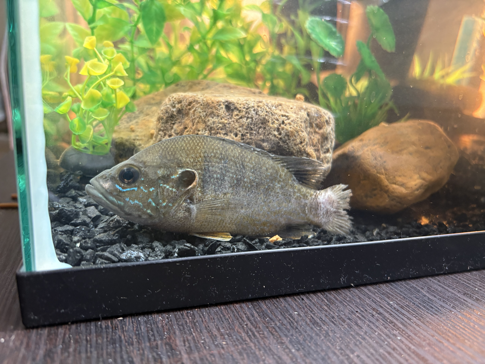
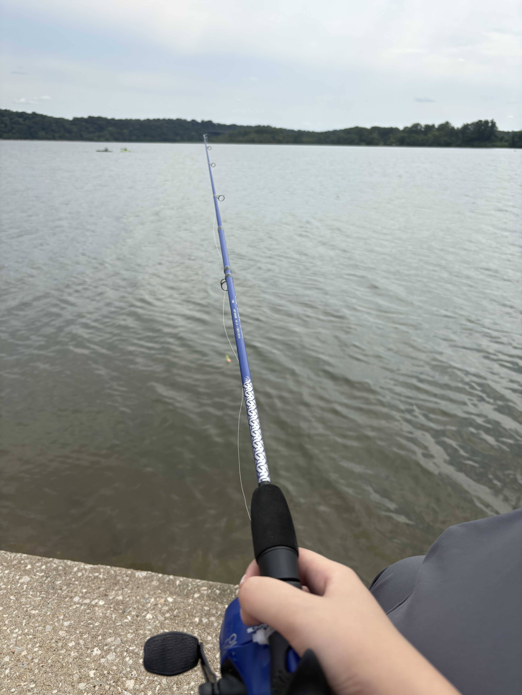

夏天，我们开始在湖里钓鱼。

按理说钓鱼比较讲究技术。要不玩路亚，假装自己的鱼钩是一条鱼，吸引大鱼咬钩；要不是拴好浮漂，做一套钩组，挂上鱼饵，甩到湖中心静待鱼儿上钩。

但我不是，我选择最原始的方法，我戴上偏振墨镜，看哪里有鱼，把挂着蚯蚓的钩往下一扔，然后静待鱼好奇咬一口，迅速拉上来。所见即所得的方法效率极高，上鱼速度超过了使用专业方法的我的对象。

于是他也开始和我一起刮地皮。

我们刮到很多鱼，都是太阳鱼，由于它们生存能力强（在中国已经是入侵物种了），想着应该很好养活，我们就带回来打算自己养。

周六钓到，晚上紧急下了鱼缸订单，周日就给鱼换上十加仑的大房子，配上我特意挑选并打印的深水水草背景。

为了腾地方，电视被搬进了卧室，电视柜彻底变成了鱼缸柜。

一开始真挺像那么回事的，看着鱼快乐地在水里游，听着滤水器营造的流水声，感觉到一种家里添了活物的美妙气氛。就连睡觉都有白噪音，睡得更香了。

对象做了很多功课，买了滤水的药，沉积颗粒物的药，治疗寄生虫的药，测水质的试纸，等等等等。每天睡醒就是看见他在外面摆弄瓶瓶罐罐，对鱼可真是太仔细了（绝无阴阳怪气的意思）

我们觉得很有意思，下一个周末接着去钓了。又钓上几条，还抓住只小龙虾。回去的路上我们还担心会不会鱼缸太满住不下这么多鱼。

推门一看，有一条鱼翻肚皮了。

好吧，突然换环境是会死的，对不起你，我啊啊啊地叫着，让男朋友把鱼扔进垃圾桶。

隔离一天，拿回来的鱼又死了两条，可能是钓的时候伤到了腮，我感到很罪恶，但是都钓上来了，事情已经发生，我只能在心里跟上帝说完跟佛祖念叨，老美可能归上帝管，保佑鱼下辈子当个好生物，不要再这么容易上钩了。

在暑假的这几个月里，鱼死了我们就去钓新的，有的是身上长寄生虫带回鱼缸爆发了，有的是应激，有的是被其他鱼攻击伤了尾巴感染了，死因多种多样，买回来的治病药水也逐渐摆满窗台。真是罪恶。但没有我可能也是会被湖里的大鱼吃掉的，这是大自然的一部分，我逐渐调理好了。

但抓回来的小龙虾倒是十分强壮。在缸里呆了两个多月，蜕壳两次，一次比一次大，中间还自己跳缸从客厅走到了我们卧室的衣帽间。也不知道怎么活下来的，我都快要怀疑虾其实能在陆地生活了。

现在已经10cm，根据gpt所说，10cm的小龙虾已经算是大的了！希望还能再长大些，多陪我们几年。

但尽管如此，有鱼的前科，我们还是不敢给虾起名，真的很担心它随时死掉。

没见到它产卵，姑且认为是男的，就这样管他叫虾bro。

不说养鱼了，说回钓鱼。

我们常去的湖里只有太阳鱼和鲶鱼。鲶鱼长得非常丑，神情神似维斯塔潘。湖边总有几个中年人把钓到的鲶鱼塞进Home Depot的油漆桶里带回家吃。

我一直以为美国人都很懒，美国超市里从来没有完整的鱼，都是处理好的鱼排，没想到还真有这么一群原教旨主义者，从钓鱼开始吃鱼。想想，还有那么多人喜欢打猎，从买枪开始觅食。美国真是人少资源多啊，就这样吃野生动物，如果中国也人人都这样，那很快就没有野生动物了。

我其实不是很喜欢钓鱼，一方面因为钓鱼需要活饵，我实在是不想剪断蚯蚓，也不想把活蹦乱跳的蚯蚓挂到鱼钩上。另一方面，钓上来的鱼既不好看，也不亲人，拿回来养着也没有观赏鱼的效果，反倒有一种中国超市的水产摊位的既视感，看到我养鱼的朋友都问我这个鱼能不能吃。

不过我依然享受钓鱼这个过程，找个椅子坐在湖边晒太阳玩手机很惬意。比躺在床上玩手机舒服些。

这种在湖边和缸前的折腾，大概只是想通过钓鱼获得一点和活物的互动，尽管这种方式看起来有点傻。

我始终没法和这些水生生物建立起像养狗一样的精神链接。哺乳动物之间的情感共鸣在鱼缸面前并不适用。物种之间差得太远，相对无言，确实没什么可说的。


