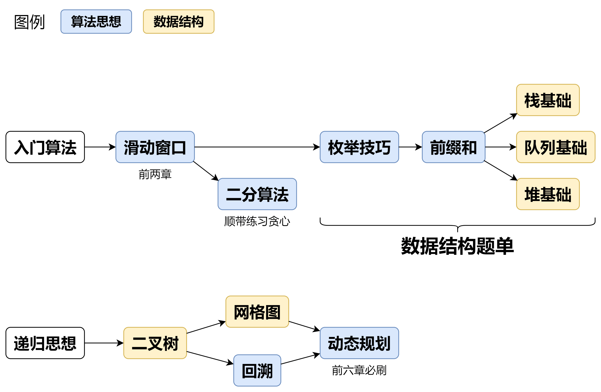

参考：[分享｜如何科学刷题？](https://leetcode.cn/discuss/post/3141566/ru-he-ke-xue-shua-ti-by-endlesscheng-q3yd/)

视频讲解：[灵茶山艾府_合集·基础算法精讲 高频面试题](https://space.bilibili.com/206214/lists/842776?type=season)

题目合集：[【基础算法精讲】题目+题解汇总](https://github.com/EndlessCheng/codeforces-go/blob/master/leetcode/README.md)

按照专题一道一道做……

我的方法：

1. 去b站听讲解
2. 自己写对应的题
3. 计算时间复杂度
4. 学习leetcode中runtime更少的解法
5. 课后作业
