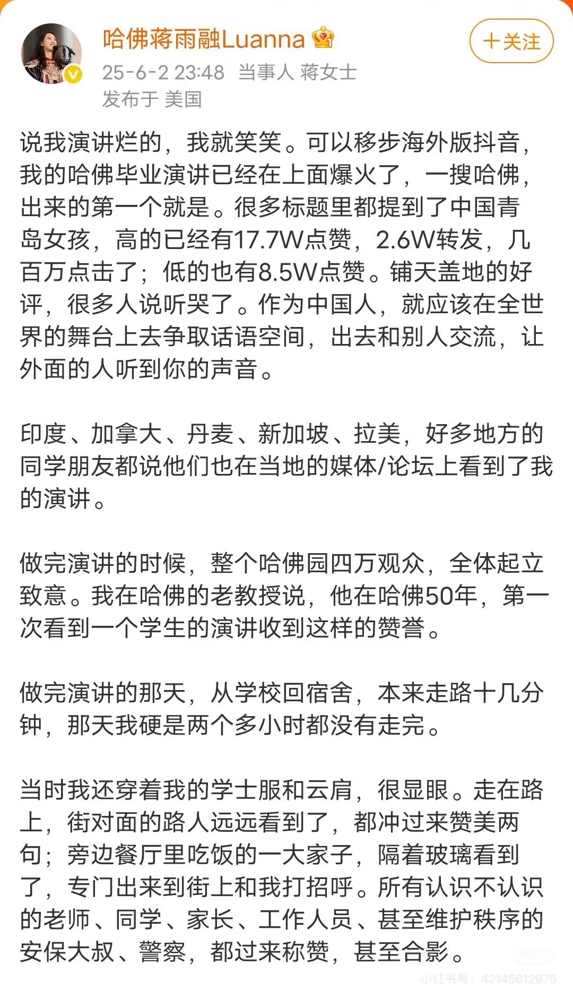

近日，一位哈佛华裔毕业生的演讲及其后续讨论，在公众视野中引发了不小的涟漪。在观看和思考之后，一种难以名状的困惑挥之不去。此文并非对演讲者个体进行褒贬，毕竟，能够立于那样的平台，已是其个人能力的体现。让我感到疑惑的是，这类“拯救世界”的宏大辞藻，怎么看怎么正确，但无论是墙内或是墙外，左派还是右派，不同政治立场的人纷纷表达了自己的反感，包括我。这样的矛盾感使我写下这篇文章。

## 努力与家庭资源谁更重要

典型的美式演讲常遵循一种结构：演讲者回顾早年困顿，阐述如何凭借奋斗取得成功，并最终生发改变世界的抱负。这种叙事模式因其励志色彩而广受欢迎，是怎么打也不会出错的安全牌。

然而，审视这类叙事时，一个必须要考虑的问题是：在演讲者高度强调的“个人努力”之外，那些被淡化或忽略的家庭资源、精心规划的教育路径，究竟在个体成功中占据多大权重？当一位履历令人艳羡的演讲者，其求学之路呈现出完美的富有、流畅与顺遂，公众自然对其主要靠个人奋斗而不是家庭背景的自我剖析持怀疑态度。

当聚光灯下的精英为远方的边缘群体代言，呼吁倾听弱势群体的声音时，一种错位感便油然而生。真正身处边缘、缺乏话语权的人们，其困境远非一次公开呼吁所能概括，他们甚至难以获得进入这类精英场域的入场券，穷苦的生活仿佛只是精英展示善良与正义的背景板，一种落后不发展的景观。

可是演讲者却似乎不理解这点，在她的微博回应中，她反复强调自己的努力，忽略家庭的帮助与规划，达到了一种越说越错的反效果。我甚至有点怀疑她所说的帮助第三世界国家发展到底是作秀还是真实，毕竟只要稍微从自己所在的一线城市抬起头，看看教育资源并不发达的地区，就能面对血腥的事实，在一个一线城市出生、接受教育，是一种多大的幸运。

我的学校曾经做过一场实验（这样说可能不太符合伦理，但确实如此），具体可见[人物 - 一群穷孩子的人生实验](https://mp.weixin.qq.com/s/9N_F6k2a2Tu-o76F3-Q0IQ)。简单来说呢，就是2009年，学校通过考试选拔了一些智力相对高的小孩，他们是在京务工人员的小孩，穷得上不起学，但确实高于平均值。但他们的出路在社会中的百分比却并不如他们智商所在的位置，条件较好的能够考上名校，最没钱的上不起高中或是大学。

同一年，我的学校也招了正常的北京户口的相同智力水平的小孩。两个班的教育方式基本完全一致（除了正常班没有各界企业赞助），后来这个班出了那一年的高考理科状元。这个班型当然正常地招生下去，如今已经进行到十几届，我是第三届。我至今无法忘记看到这篇文章的震撼，我感觉我的三观都崩塌了，原来我的努力只占超级小的一部分，如果我没有北京户口，或者家里没钱，那我也不可能达到现在的水平。我很崩溃，我和妈妈聊起这件事，她让我别想那么多，真要说起来，父母给你的好脑子也是不平等的资源，哪有绝对公平的事情。抓住你现在所拥有的，努力，然后尽你所能改变你看到的不平等，这就是所有你能做的了。

从那之后我再也不敢说自己努力了。随着上的学逐渐变好我也看到很多更有钱的人，我发现努力确实什么都改变不了，人生的分水岭确实是羊水。可惜这位演讲者完全没有机会能意识到这一点，或者根本不愿意承认这一点。

## 宏大叙事下的真实感缺失

“致力于解决全球贫困”、“终结地区冲突”、“为全人类共同的未来贡献力量”……这些无疑是具有高度道德感召力的目标。但在当前的社会语境下，这类宏大叙事在精英阶层的公开表达中日渐增多，有时甚至予人一种“通货膨胀”之感，在不断重复中，严肃性被稀释，剩下的只有假大空的套话。

拥有改变世界的使命感值得肯定，但其价值的真正实现，离不开对复杂现实问题的深刻洞察和长期具体的实践。若这种使命感的形成，只是基于几次短期的国际项目调研或实习，唯一的作用是大学申请与公共演讲中富有感染力的辞藻，那么这种善意的深度、其行动逻辑的严谨性以及最终能产生的实际效用，便难免会受到公众的质疑。

在网友不断的质疑声中，她发表了这样的微博，也许是论点太过好笑，网友更加愤怒，现已删除。她强调“作为中国人，就应该在全世界的舞台上去争取话语空间，出去和别人交流，让外面的人听到你的声音”。这种对话语权的强调和对数据成功的展示，固然可以理解为一种自信和为国争光的意愿，但也让我感到一种微妙的不适。当“争取话语权”本身成为一种被追逐的目标，甚至成为衡量成功的标准时，话语的内容、真实性以及它所能带来的实际改变，是否会被置于次要位置？这种话语权的获得，究竟是源于其观点的深刻与实践的扎实，还是更多地依赖于其所处的平台（如哈佛）以及个人已经拥有的光环？它是否也可能演变成另一种形式的宏大叙事，看似覆盖全球，实则与个体经验渐行渐远？

我想起参观NASA肯尼迪航天中心的经历。工作人员不仅为人类探索宇宙的壮举自豪，也同样骄傲于他们在保护周边自然保护区内野生动物及生态环境的细致工作。那种脚踏实地，既仰望星空又关照脚下土地的劲头，让我感到特别真实和钦佩。这是一种无需刻意争取便能赢得尊重的力量。

可是，并非所有关心世界的姿态都能带来积极感受。有网友提到，在一些发展中地区，某些NGO组织虽初衷良好，实际操作中却可能困扰当地人的发展。例如，改善生活的项目刚启动，便可能因污染环境或对动物不友好的指责而搁浅。这让我思考，口号式的全球关怀若脱离当地具体需求，是否会事与愿违？当话语权高度集中，并以看似普世的姿态介入具体事务时，其潜在的负面影响同样值得警惕。

相较于那些有时显得表演痕迹重，内容并不太走心，只是想调动现场气氛的演讲，我更相信沉默但持久的付出，以及真正致力于理解和解决具体问题的努力，而非仅仅停留在争取声音的层面。

## 让人不舒服的精英词藻

让我感到尤为别扭的，是她在一些场合提及个人成长经历时的某些表述，例如声称小时候家庭不和、在学校遭受严重欺凌，甚至有被“扒光衣服”羞辱的经历。然而，这些说法很快便有据称是其初中同学的人出来反驳，指出她当时在学校品学兼优，是校方重点宣传的“三好学生”，并未发生过所谓“扒光衣服”的事件。我并非要探究其个人隐私的真伪，毕竟每个人对经历的感受和记忆可能存在差异。但这种叙事方式，放在她所处的具体情境下，确实引发了我的深思。

我当然理解，个体成长过程中难免会遇到各种困境与创伤。但当一个在公众认知中已经拥有巨大资源优势的个体（例如，成长于青岛这样的一线城市，周边是3万一平的学区房，这与她暗示的困境存在反差），在公开表达中着重强调甚至可能夸大其“悲惨”经历，试图以此争取那些在物质条件、社会资源上远不如她的群体的理解与共情时，这种姿态就显得非常值得商榷。这恰恰触碰到了当前社会情绪中一个非常敏感的痛点：在阶层日趋固化、向上流动日益艰难的背景下，普通人对于自身努力与回报不成正比的失落感，以及对既得利益者试图掩盖或美化其特权来源的反感。

更令人不适的是，在她后续的澄清声明中，那种试图解释学校条件不好的措辞，反而暴露了某种深植内心的优越感。她提到，那所初中“同学们基本上都是外地打工子弟，或者菜市场里的普通小生意家庭” 。这样的表述，在许多人（包括我）看来，不仅未能成功卖惨，反而无意间流露出对特定群体（外来务工人员子女、小商贩家庭）的某种标签化甚至隐性的歧视。这与她在演讲中所标榜的“人性”（humanity）似乎背道而驰。这种对自身出身和环境的微妙切割，有时甚至不惜以贬低旁人为代价。“公主落入贫民窟”式的叙事，不仅不合时宜，字里行间的俯视感也让所谓共情显得虚假。

她还描述“很多同学早课前和放学后，都还得去自家铺子帮工”，还有自己因为成绩太好被霸凌，也引来了网友的质疑。正如前文所说，在周边房价3万一平的青岛，这样的描述似乎更像是从某些异国或是年代久远的文艺作品中撷取的苦难符号，而非对现实生活的准确描绘。当构成苦难叙事的细节本身受到质疑时，整个叙事的说服力便大打折扣。

这种“我也很惨”的叙事，如果被认为缺乏足够的真实性支撑，或者与其公开可见的优越条件形成巨大反差，就很容易被解读为一种策略性的卖惨，一种旨在消解自身精英色彩、拉近与普通人距离，甚至获取道德资本的手段。然而，当这种手段被识破或受到质疑时，其效果往往适得其反，反而会加剧公众的不信任感和被冒犯感。人们会质疑：既然已经拥有了如此之多的优势，为何还要在苦难这个维度上与普通人争夺叙事权？为何不能坦诚面对并承认家庭背景、社会资源在个人成功中所扮演的重要角色，而一味强调个人努力？

毕竟，在现实中，无数人付出了同等甚至更多的努力，却远未达到同等的高度。正如我所感受到的，我可能觉得自己比她更努力，许多高考生更是付出了常人难以想象的艰辛，但他们所能选择的道路和最终能达成的成就，却可能因起点不同而有天壤之别。她可以学习那些看似虚无缥缈的文科，并将其作为通往国际舞台的跳板，而像我一样的普通人则不得不更早地考虑生计，选择更为实用的路径。

更有网友尖锐地指出，如果她对曾与之共处一校的、条件不好的同学们怀有如此深切的“看见”，为何在其后续的慈善或调研中，更多展现的是对非洲、蒙古等远方议题的关注，而鲜少提及对近在咫尺的、昔日同窗们的具体帮扶或关怀？这种选择性的看见与施助，也使得其“世界大同”的理想显得有些遥远和不接地气。

只强调个人奋斗而淡化结构性优势，甚至试图通过共情苦难来弥合阶层差异的做法，不仅难以真正赢得理解，反而可能加剧疏离。因为它回避了对特权本身的反思，也未能真正回应公众对公平的深切渴望。许多网友的反感，并非简单的仇富或酸葡萄心理，而更多的是对这种德不配位的失望，尤其是当这种不真诚披上了为国发声这种宏大外衣，并与穿着汉服等象征性行为结合在一起时，那种虚假与伪善的感觉便被无限放大了。

这种特定的话语模式，在某种程度上，其功能已超越了单纯的思想交流或情感表达，而更像是一种精英身份的自我确认与社会展演。它似乎在潜意识中传递并强化一种信息：“我们因所受的顶尖教育和所处的优越位置，而天然具备了思考和引领解决这些宏大命题的资格与责任”。然而，当这种精英意识形态——它可能既是演讲者个人信念的体现，也是其所属顶尖学术机构长期熏陶的结果——高谈阔论全球福祉、生态保护的时候，许多普通公众却仍在为日常生计、工作机会和基本保障而焦虑。这种话语与现实的脱节，削弱了精英话语的公信力，也加剧社会不同群体间的隔阂。

## 而我又怎么不是一样的人呢

在进行上述思考时，我亦无法回避内心的挣扎与反思。一方面，从务实的角度看，在现实社会中，许多重大议题的突破和关键性社会进步的达成，往往需要那些掌握更多社会资源、拥有更广阔平台和更大影响力的人士或机构来主导和推动。普通个体的力量，在庞大的结构性问题面前，时常显得力不从心。

但另一方面，当看到蒋雨融和她的同路人在社交媒体上阐述其行动的正确性，提及他们在国内乡村扶贫的努力，关注当地学生的教育问题，关心年轻女孩能否负担得起卫生巾……我当然承认这些行动本身的积极意义，可是又忍不住会想：正如一些批评声音所指出的，造成这些地区贫困和资源匮乏的深层原因，就是整个社会资源分配的巨大不均，以及由此形成的阶层固化啊。

而他们，作为这个结构中的既得利益者，他们试图解决的问题，就是因为他们存在而产生的。他们以一种“拯救者”的姿态出现，善意或许不容置疑，可行动本身，也许强化了某种既有的权力结构。

明明享受了普通人难以企及的优势和便利，却在公开场合极力撇清这些，只强调个人奋斗，甚至以一种悲天悯人的姿态去“俯身”倾听底层，对自身的优势地位缺乏足够的反思。大家期待的是公平的起点，也接受别人因为更努力而获得更好的结果，但当许多人连“努力的机会”都难以找到时，那种只强调个人成功的叙事，就很容易让人觉得刺耳，甚至像是一种冒犯。

这种批判性的审视一旦开始，便不可避免地会反观自身。当我与朋友讨论，认为通过关系或捷径进入名校的方式不那么值得称道时，内心深处的声音也在拷问：回顾我自己的人生历程，难道我就没有抓住过一切可以抓住的人脉，没有使用过“关系”为自己争取机会吗？答案是肯定的，我的推荐信也来自于父母的人脉。我确实在实习时做了对应工作，也确实比组内研究生更出色，赢得了认可，但这并非完全公平的竞争起点，比我优秀的人很多，大家都缺少机会，而我获得那个初始机会的方式，的确并非依靠实力。

于是，“五十步笑百步”的窘迫感油然而生。我似乎失去了理直气壮指责他人的立场。在资源更少的人眼中，或许我和蒋雨融都属于掌握更多门路和机会的群体，都是现有不平等体系中的相对受益者。我对此无话可说。我批判特权，却在现实中无法完全摆脱对既有规则的利用；我同情弱者、指责强者，却发现自己可能在另一参照系中扮演“强者”的角色。

评判他人行为动机的复杂性也在此刻凸显。他们投身公益，是真心实意的悲悯，是精英阶层某种形式的责任感，是个人履历的镀金，还是仅仅一种不自知的“何不食肉糜”式的自我感动？或许，这些因素都或多或少地交织在一起，难以简单剥离。

而她微博中那句“如果我们不去争取话语权，就会被别人代言”，在我看来，也透露出一种微妙的视角错位。她本身已然站在聚光灯下，拥有了普通人难以企及的平台和发声渠道，在某种意义上，她已然是那种可以“代言”的“别人”之一。她所说的“照亮角落”，其光芒是否真的能穿透层层壁垒，抵达那些真正需要被照亮的、沉默的角落？她拥有可以不关闭评论区、可以从容不迫回应所有争议的权利和底气，这本身就是一种基于资源、背景和平台的特权。而许多像我一样的人，可能连在公共空间表达一句真实想法，都要再三斟酌，担心被网暴。就像我，为了论证的效果，在开头说了自己的中学信息，提心吊胆，害怕被人找出来人肉。这种话语权拥有上的不对等，是无法被轻易忽略的。

我并不想否定她个人为达成目标所付出的努力，也不是认为精英阶层就不应该怀揣理想、表达观点。但我希望，我们能够更清醒地穿透那些华丽的辞藻和感人的叙事，看到其背后所依附的资源差异和难以撼动的结构性不平等。

我们当然希望有人为这个世界变得更好而发声，也需要有人去推动改变。但如果这些声音总是来自那些已经占据了优势地位、自带光环的人，那么我们作为倾听者，也应该保留一份思考和质疑的空间。


