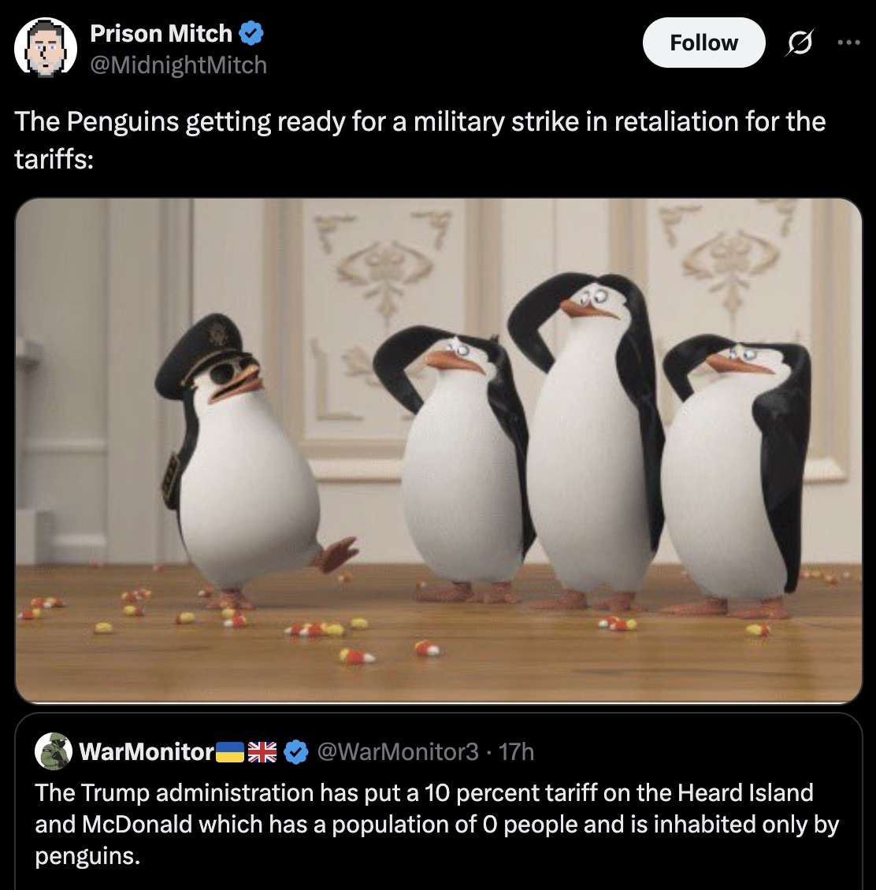
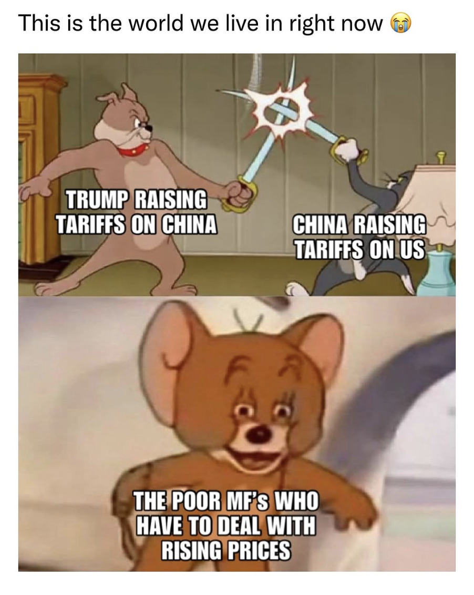

## News

上周也不知道怎么回事，Trump疯了一样地征全世界的关税，本人作为一个不太关心政治的人，突然发现互联网上一片哀嚎。

遂仔细去网站上看，但我有阅读障碍，白宫发的那些东西划都划不完，于是找了NBC的总结：[Tariff timeline: How Trump turned global trade into an economic battlefield](https://www.nbcnews.com/business/economy/tariff-timeline-trump-trade-war-global-economy-rcna196487)

March

- **March 4**: U.S. imposes 25% tariffs on almost all goods from Canada and Mexico, plus 10% on goods from China. Canada and China respond with retaliatory threats.
- **March 5**: Trump gives U.S. automakers a one-month reprieve from Canada/Mexico tariffs.
- **March 6**: Products under the USMCA agreement are exempted.
- **March 7**: Trump threatens reciprocal tariffs on Canadian dairy and lumber.
- **March 10**: Ontario adds a 25% surcharge on U.S. electricity. Trump threatens 50% tariffs on Canadian steel and aluminum.
- **March 11**: Ontario backs down.
- **March 12**: 25% global tariffs on steel and aluminum take effect. Canada and EU announce retaliatory duties totaling ~$49 billion.
- **March 13**: Trump threatens 200% tariffs on EU wine and champagne.
- **March 26**: Trump announces 25% tariff on foreign autos/parts (starting April 3).
- **March 27**: Trump threatens bigger tariffs on EU and Canada if they retaliate.
- **March 30**: Trump says tariffs will apply to "all countries" from April 2.

April

- **April 2**: Trump announces baseline 10% tariff on all imports. Higher for some items.
- **April 3**: Stocks plunge. 25% auto tariffs take effect. Stellantis halts production in Canada/Mexico.
- **April 5**: 10% tariffs on certain countries go into effect.
- **April 7**: Trump threatens additional 50% tariff on China.
- **April 8**: The 50% China tariff takes effect.
- **April 9**: More April 2 tariffs take effect. U.S. imposes 104% on China. China raises retaliation to 84%.
- **April 10**: Trump clarifies total duties on China are now 145%.
- **April 11**: China boosts retaliation to 125%.

对应的，老中也加了对等的关税。[国务院关税税则委员会关于调整对原产于美国的进口商品加征关税措施的公告](https://gss.mof.gov.cn/gzdt/zhengcefabu/202504/t20250409_3961684.htm)

4.2增加34%，4.9从34%到84%，4.11从84%到125%。在4.11的[公告](https://gss.mof.gov.cn/gzdt/zhengcefabu/202504/t20250411_3961823.htm)中，他们还说`鉴于在目前关税水平下，美国输华商品已无市场接受可能性，如果美方后续对中国输美商品继续加征关税，中方将不予理会。`

不过到今天，我又听说这些政策先暂停了。不太关心，可能是在国内呆久了，已经非常习惯领导人一拍脑门搞出荒唐的事情而我只能看着什么都做不了。我是非常容易政治性抑郁的人，看了这个就会浑身难受。

## 周围人的反应

网上出现了一些meme图，比如
 

全球的股市📉📉📉，meanwhile黄金暴涨。我的赌徒心理告诉我现在可能是抄底的好时机，不是说恐慌指数越高就越是买的好时候嘛。但我确实不能相信Trump，也不相信我的投资水平，我2020年买的基金甚至有亏了50%的，还是老老实实呆着吧。但是下载个truth跟着他买倒确实是能赚……这人真够坏的

> On Wednesday, shortly after the U.S. stock market opened, Trump posted on his [Truth Social network](https://truthsocial.com/@realDonaldTrump/posts/114308272725981913) in all caps: "THIS IS A GREAT TIME TO BUY!!!"
>
> Less than four hours after his post, Trump said on [Truth Social](https://truthsocial.com/@realDonaldTrump/posts/114309144289505174) that he would pause the harshest of his tariffs on most countries.
>
> His decision, announced on social media in the middle of the trading day, [caused stock prices to soar](https://www.npr.org/2025/04/09/nx-s1-5357405/stocks-tariffs-china-eu-trump-trade-war).

---

我的朋友说她的同事为了统计受影响的业务加班到半夜十二点。但随着两边的数字越来越高，大伙反倒不在乎了。34%还有真实施了大家捏着鼻子自掏腰包做生意的可能。可是一百多就太好笑了，难道生意还能真不做了？真不做两边都不好过，感觉不太现实。

而我爸呢，看热闹不嫌事大，天天转发一些短视频说这样基本等于战时状态，中国可以收拾收拾去和台湾打仗了。他一边说这个一边说美国对华人不好你早做打算，但是感觉不像为我想办法，更像吓唬我让我回去呢。

我妈天天在我爸旁边，也跟我说美国不好就不呆了，让我早点看看离家近的地方，比如港新。

可是我确实对亚洲没兴趣，让我在儒家文化圈呆着我就身上有蚂蚁爬。

我的俩妹妹去Stanford shopping center逛街，正好赶上有很多人在Tesla门口抗议。是两拨人，Trump的支持者和反对者。我没去，自然也不知道是什么景象，但当天的晚饭时间，妹妹们说了和她们和Trump supporters都聊了什么。细节我不太记得了`她俩用英文说的`，总结一下有如下几条：

老大比较有攻击性：

- Trump支持者脑子不太好使，不知道驱逐了非法移民根本没有人愿意做时薪低的工作。他们非常理想化，觉得人就该go to college and做比较体面的工作，根本没想过没人做blue collar job怎么办。
- 脑子不太好使x2，他们不愿意相信反对他们的新闻，只看他们喜欢的。`当然这点人人都有，我们也看不下去republican的媒体，但只能说他们水平太低比较好骗`
- 脑子不好使x3，先不提美国转移了多少制造业去亚洲，就算这些业务都回来了，美国根本没有那么多人去干这些活，比如在中国和印度组装的iPhone。据[NYT所言](https://cn.nytimes.com/opinion/20250411/tariffs-china-iphone-apple/)有3亿中国人在这条供应链上，而美国只有3亿人。

而老二更关注抗议的人，她疑惑怎么有asian和年轻白人也在队伍中。我只能说对一些人来说，他们在中国待久了习惯这种独裁的模式和要当老大的感觉，同时把自己当白人了，才有这些事。而且也是受文化影响，自己的福利受损他们可能不在乎，但小孩可能变成同性恋无法产生后代真的是比杀了他们还难受。断子绝孙在相当长的时间里是一句很恶毒的curse。

但我们其实也都没啥办法。去年我还问大家投没投票呢，他们说在湾区有什么好投，宇宙毁灭了San Mateo County都不可能红。

确实是这么回事。
