写本文的原因：

- 朋友很爱写文章，但很讨厌发在微博知乎豆瓣lof等一众平台说审核就审核，说被删就被删的现象
- 与此同时墙外的文字网站特别难上，对读者也不方便
- 朋友觉得有个人网站需要很高的技术含量`显然不是`

对草履虫的要求：

- 有个电脑`不是手机和ipad`，电脑上有浏览器`包括但不限于edge safari chrome firefox`
- 能访问[GitHub](https://github.com)并注册账号。
- 不害怕写代码的界面。你不需要自己写代码，但需要改一些别人写好的代码。

成品：和本网站一样的使用hugo创建页面并托管在GitHub上的网站。截止到本文写作时间这类网站还能在中国大陆境内打开，之后要是不行再想别的办法。

好了 现在开始➡️

## 注册GitHub账号

首先，打开[GitHub](https://github.com)。点右上角，有账号就`sign in`没账号就`sign up`。


你此刻选择的用户名会成为你的网站链接，格式为 [用户名].github.io。当然不想要这个网站你也可以随时上网买一个你想要的域名，现在先忽略


 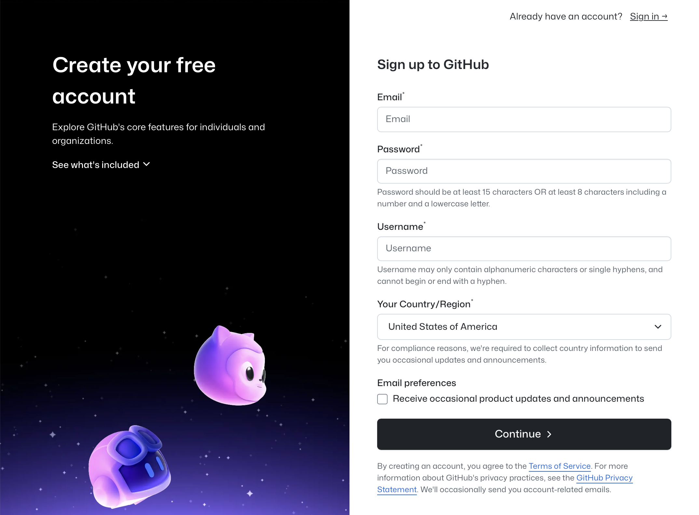

## 克隆别人的仓库到你的账号

人话：把人家作业[(hugo-theme-stack)](https://github.com/CaiJimmy/hugo-theme-stack)复印一遍写上你自己的名。



点上面的卡片，进入github之后先点`use this template`再点`create a new repo`
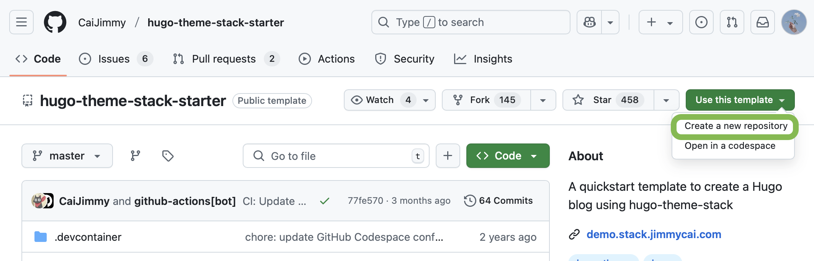

之后把`Repository name`设置为`你的用户名.github.io`，其他选项都和截图保持一致


GitHub要求用户站点的repository必须以`<user>.github.io`的格式命名，其中`＜user>`是您的GitHub用户名。这个repository必须归您的帐户所有，并且必须公开才能发布用户站点。

请注意，其他任何名称的repository都不能用于此目的。如果您尝试使用类似`222.github.io`这样的名字进行站点构建，则无法正常工作。


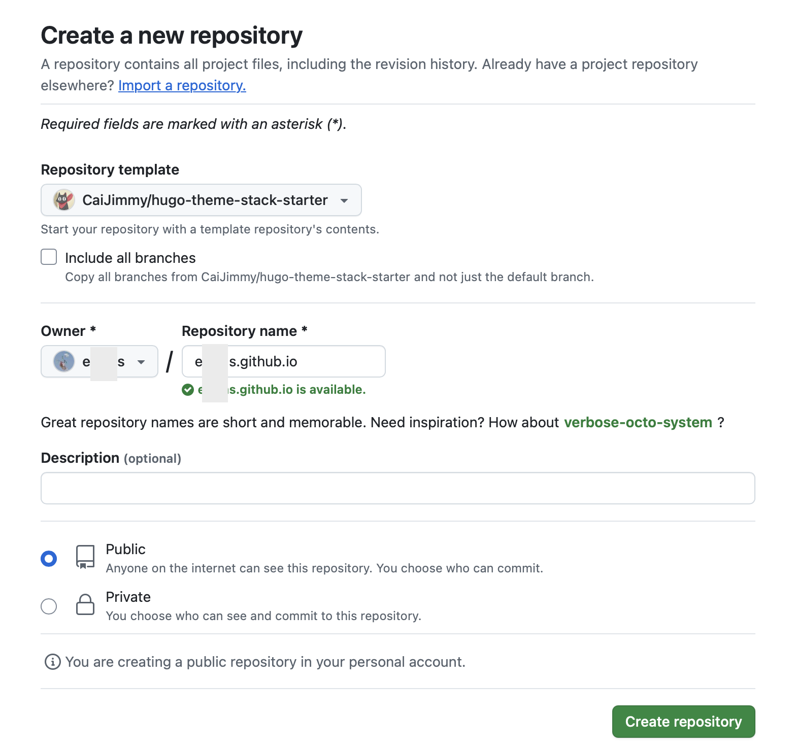

然后你就获得了如图所示的崭新的仓库。
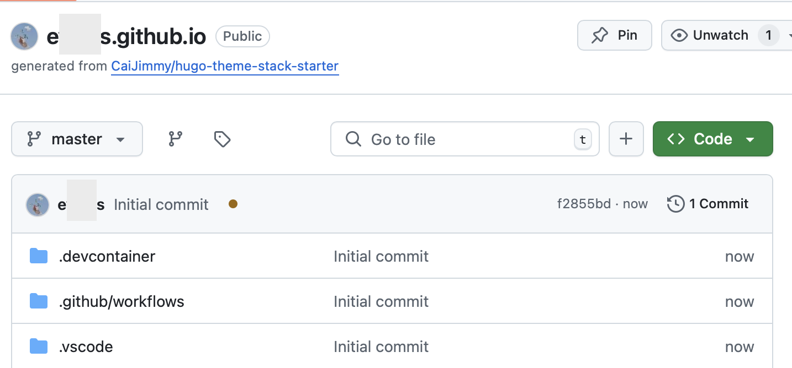

点`code`按钮，选择右边的codespace，点下面这个绿的
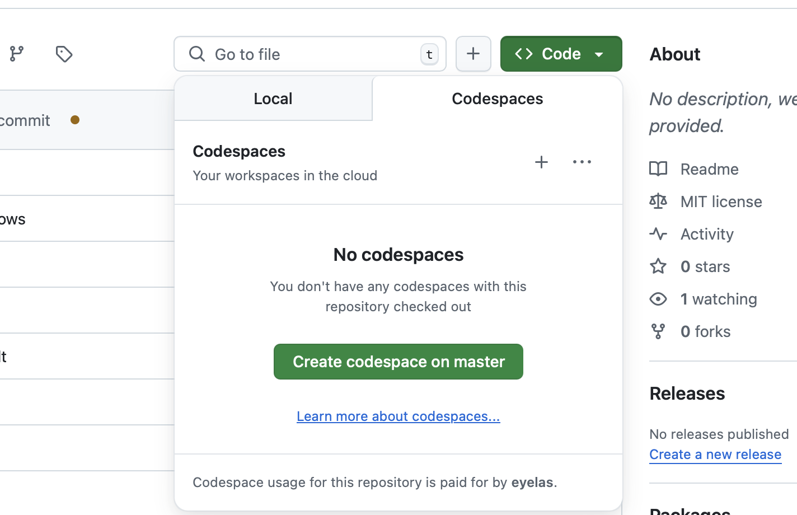

出现如下图所示的新页面。等待一小段时间，第一次加载需要一分钟是正常现象
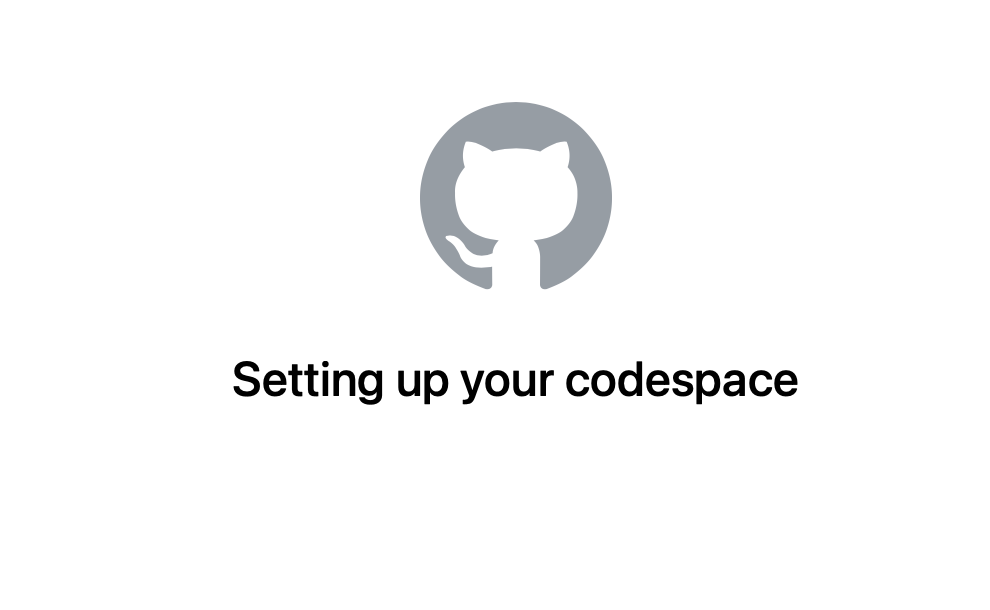

当 Codespace 打开后，你会看到一个像这样的界面：左边是文件列表，右边是代码编辑区。不要害怕，我们只需改几个文件。


## 修改网站信息（config）

找到左侧文件列表中的 `config/_default/config.toml` 文件。

别人的作业已经拿到了，现在该删掉他的名字改成自己名字了

请修改以下内容（改成你自己的）：

### 网站名称

```toml
title = "你的名字或网站标题"
baseURL = "https://你的用户名.github.io/"
```

比如我叫小红，GitHub用户名是 `xiaohong`，那我就写：

```toml
title = "Xiaohong's Site"
baseURL = "https://xiaohong.github.io/"
```

### 界面（语言，每页条数）

```toml
defaultContentLanguage = "en"

# Set hasCJKLanguage to true if DefaultContentLanguage is in [zh-cn ja ko]
# This will make .Summary and .WordCount behave correctly for CJK languages.
hasCJKLanguage = false
```

喜欢英文界面就选en，喜欢简体中文就是zh-cn，喜欢繁中就是zh-tw。注意到人家说如果选`zh-cn`就要把这里的`false`改成`true`。

下面的disqus name是设置评论区的，不太重要，先跳过。你也可以先注释掉（<kbd>CTRL</kbd> + <kbd>/</kbd> 或 <kbd>Command</kbd> + <kbd>/</kbd>）之后再加上。pagination是每一页显示几篇文章，选你喜欢的数量。本站选了8。

```toml
# Change it to your Disqus shortname before using
disqusShortname = "hugo-theme-stack"

[pagination]
pagerSize = 5
```

切换到同一文件夹的`params.toml`继续修改。

```toml
favicon = "/favicon.png" //你的网站图标。为了方便显示最好不要太大。

[footer]
since = 2020 //你的网站从哪年开始运营
customText = "" //其他的想写在页面底部的文字

[dateFormat] //日期格式，不用管
published = "Jan 02, 2006"
lastUpdated = "Jan 02, 2006 15:04 MST"

[sidebar]
emoji = "🍥" //可以删掉也可以换你喜欢的
subtitle = "Lorem ipsum dolor sit amet, consectetur adipiscing elit."//一句话简介

[sidebar.avatar]
enabled = true
local = true
src = "img/avatar.png" //换成你的网站图标
```

## 保存更改，提交到仓库

改完之后，点击左侧像电路板的按钮（1），把你的更改保存，随便输入点文字总结一下你干了什么（2）并点击commit上传到 GitHub（3）。
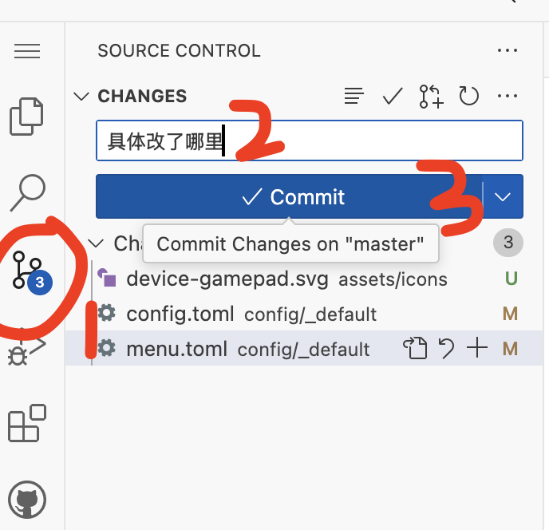

然后会出现这个弹窗，为了偷懒你可以选always。
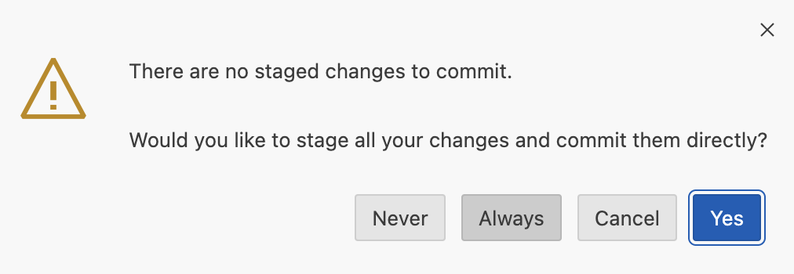

最后点击sync changes，你的代码就保存到仓库了。
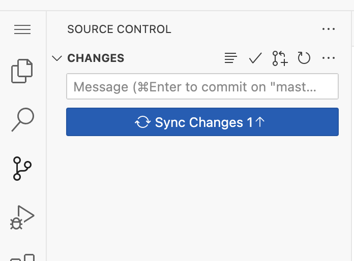

对于更详细的此部分内容，你可以参考[GitHub-关于Git](https://docs.github.com/zh/get-started/using-git/about-git)

## 预览你的网站

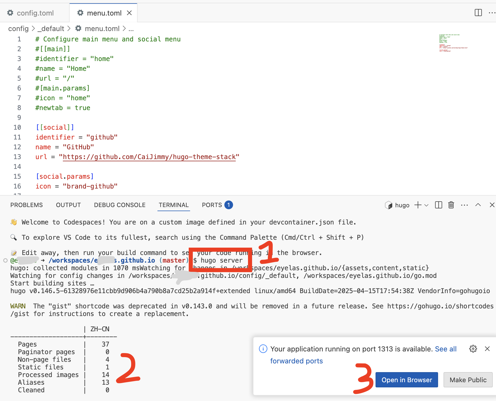

找到界面下半部分的terminal。输入

```text
hugo server
```

然后你会看到如（2）所示的表格，记录了你的网站页面和文件的数量。

右下角的弹窗会告诉你网站已经好了，可以打开。

你也可以切换到terminal边上的port，点击🌐图标打开。
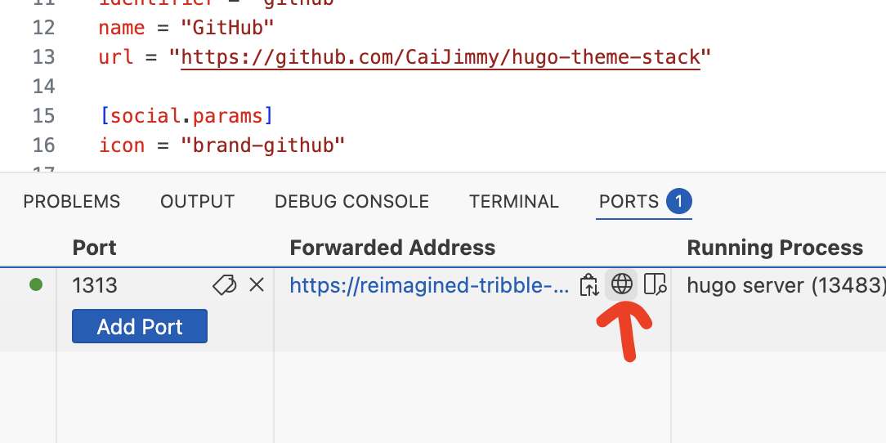

你的网站此时应该长这样
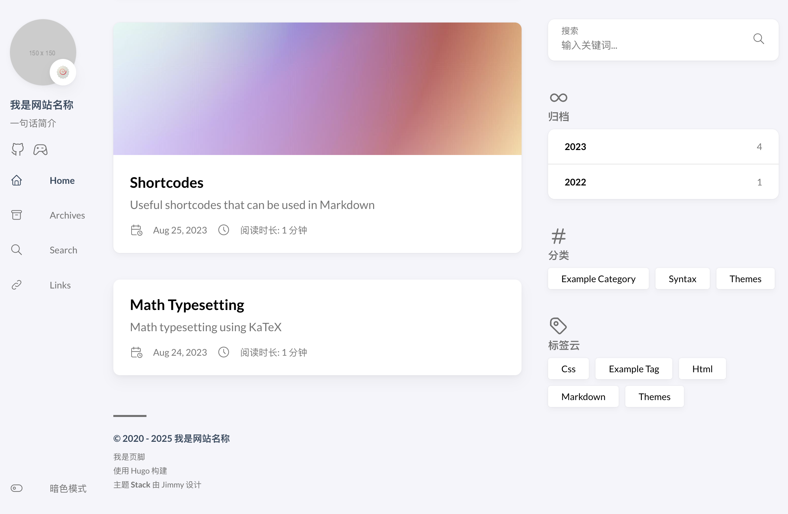

`写一半懒癌犯了，以下内容由gpt-4o完成，本人少量修改&添加截图`

## 🚀 部署你的网站

这一步非常简单，我们只需要把网站“发布”到 GitHub Page 上。

0. 回到你刚才创建的 GitHub 仓库页面
1. 点击上方的 **Settings**
2. 在左边菜单里往下滑，找到 **Pages**
3. 找到 **Source**，选择 `GitHub Actions` 作为部署方式

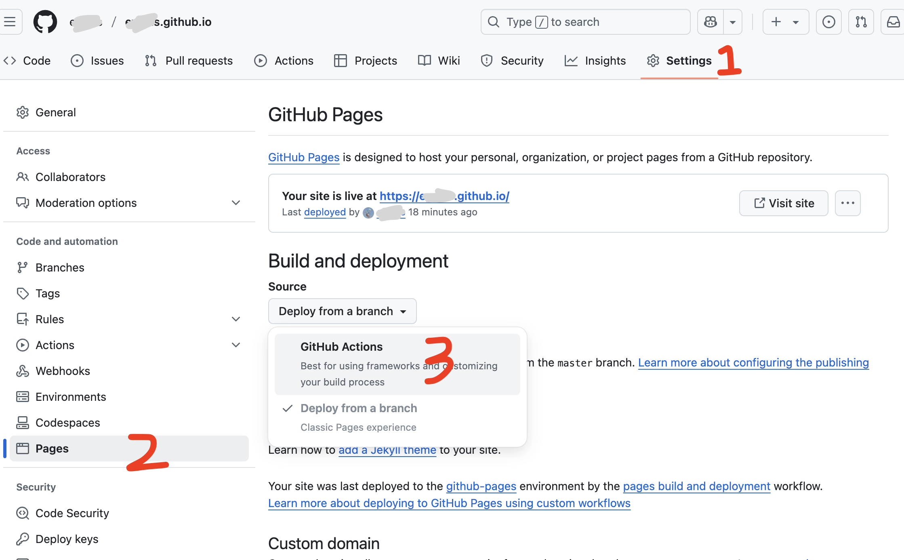

这样设置好之后，GitHub 就会自动构建并部署你的网站。等个几分钟（一般不超过 5 分钟），你就可以在浏览器中访问 `https://你的用户名.github.io/` 来查看自己的网站啦！


如果你看到 404 页面，别急，等 2~3 分钟再刷新一下页面，GitHub 需要一点时间来完成部署。



注意到截图下面有个custom domain，你可以去各种卖域名的地方买个自己的域名，填在这里，按GitHub的提示操作就可以了。


## ✍️ 修改文章内容，发表自己的文章

默认情况下，这个模板已经有几篇样例文章。我们可以先删掉它们，写一篇属于你自己的博客！

### 📁 文章的存储结构

Stack主题使用Page Bundle的方式组织文章。简单来说就是：每篇文章放在一个独立的文件夹里，这个文件夹里包含：

- `index.md`（文章内容）
- 图片（比如封面、插图）

结构就像这样：

```
content
└── post
    └── my-first-post
        ├── index.md
        ├── 1.png   ← 文章用到的图片
```

这样做可以让你更方便地插入图片，还能启用Stack的高级功能，比如图片放大、文章封面图等等。

在左侧文件列表中，打开：

```
content > posts
```

你会看到有几个文件夹，这些就是文章文件了。文章是Markdown格式的。


Markdown这个名字可能很陌生，但其实就是你复制AI的回复的时候要手动删掉的那些井号和星号。是不是一下就熟悉了！基础markdown语法可自行google或参考你下载的模板中的示例文章`content/post/markdown-syntax/index.md`。


> 但其实我最常用的也就只有标题 `一个井号是大标题H1，##和###就是显示在目录里的这些`，加粗`文字两边各加两个星号`，分割线`---`，插入图片``，插入链接`[显示的文字](链接)`

---

### 🧾 文章头文件（Front Matter）写法

每篇文章的开头需要加一段“头文件”（Front Matter），告诉Hugo一些基本信息。

比如这是本文的头文件：

```yaml
---
title: 草履虫看了也能建自己的个人网站
date: 2025-04-01
description: 写博客的应该很难再找一个像我一样懒的
image: 1.png
tags: 
  - blog
categories:
  - Maintain
---
```

解释如下：

| 字段 | 说明 |
|------|------|
| `title` | 文章标题，显示在页面和预览卡片上 |
| `date` | 发布时间，用于排序 |
| `description` | 一句话简介，显示在首页卡片中 |
| `image` | 封面图文件名，推荐尺寸：横图，存在和 `index.md` 同一目录中 |
| `tags` | 更细的标签，用于归档、过滤 |
| `categories` | 主页显示的大分类名称，用于在主页卡片上标注文章类型 |
| `weight` | 是否置顶，留空时为无，值为1时放在第一个 |


`categories` 是大类，会显示在文章卡片左上角，而 `tags` 是细分类，只会出现在文章内部或归档中。



### 🖼️ 如何插入文章内的图片

你可以把文章中用到的图片（比如截图）放在和 `index.md` 同一个文件夹下，然后用 Markdown 的方式插入：

```markdown

```

就这么简单，不需要写路径，直接用图片文件名即可。


### 🆕 添加自己的文章

1. 打开左侧文件夹：`content > post`
2. 右键点击 `post` 文件夹，选择 “New Folder”，命名为比如 `my-first-post`
3. 在这个新建的文件夹中，再新建一个文件，命名为 `index.md`
4. 粘贴刚才那段头文件和你自己的内容进去
5. 如果有插图，就一起上传到这个文件夹内

例如：

```markdown
---
title: 我的第一篇博客
date: 2025-04-01
description: 我记录搭建网站的过程
image: 1.png
tags: 
  - 搭建记录
categories:
  - 站点维护
---

今天，我完成了属于我自己的 Hugo + GitHub Page 的网站！

这篇文章是我亲手写的第一篇博客，希望你看完也能鼓起勇气开始记录自己～

下面是我的操作截图：


```

如果你在使用浏览器端的codespace，那么网页会自动编译同步你的更新`你可以在terminal中看到`。你只需切换标签页并刷新就能看到你的更改了！

不出意外的话它现在应该是这个样子。

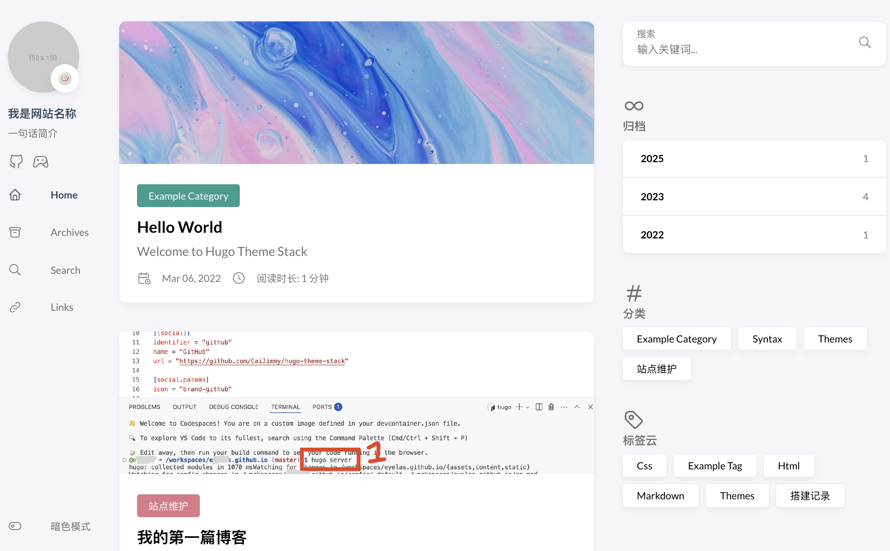

此时你已经可以把其他这几篇文章都删掉了。但我还是推荐删之前阅读一下看看网站都能显示什么。

### ✅ 保存并上传

改完之后，参照`4.保存更改`再次提交到仓库。

恭喜你，你已经有了一个默认风格的个人网站！耶！