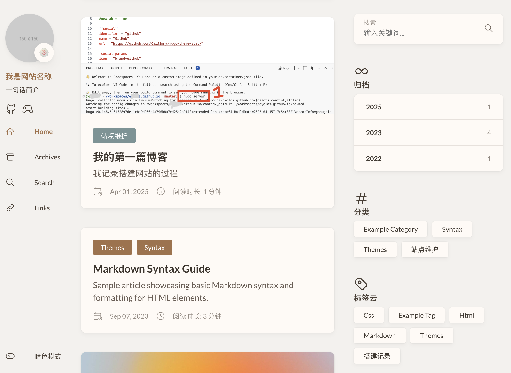
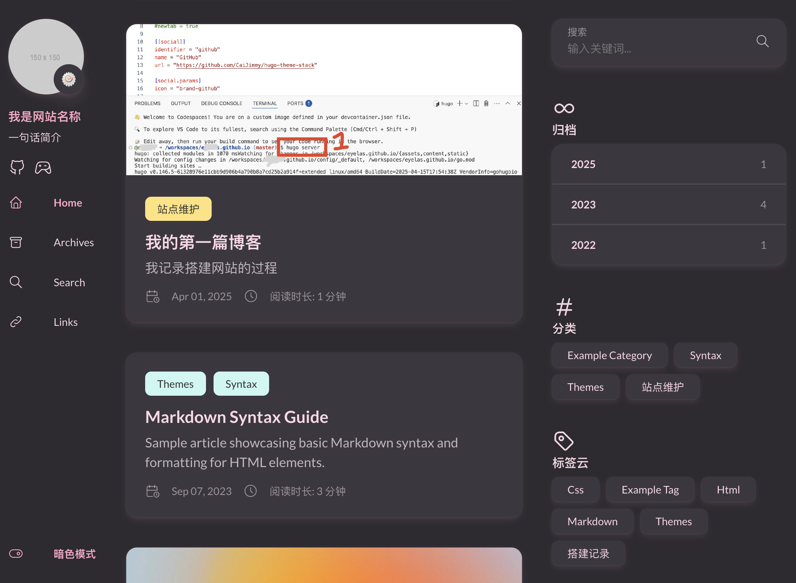

## 前置知识：主题覆盖

由于第一篇中的步骤实在是过于傻瓜，在第二篇做更多修改前我们需要小小地介绍一下原理。让我们再次请出`gpt-4o`：

> 💡 什么是 Stack 的主题覆盖（override）？

Stack 是一个现成的 Hugo 网站主题，它决定了你网站的颜色、排版、按钮样式、文章卡片长什么样等等。

当你使用 Stack 主题时，其实你的网站是“照着它的模板来渲染”的。

但有些时候你会觉得：

 
我想把按钮改成圆的，我想让文章卡片颜色再浅一点，我想让文章页上面不要显示作者名……


这些功能，Stack 主题已经有默认设置，但我们**可以自己做出修改**。这就叫做：✅ **覆盖默认主题文件（override）**

> 🧠 原理其实很简单：

**Hugo 会优先使用你自己写的文件，如果没有，才会用主题自带的。**

比如：

| 我自己写的文件 | 主题里自带的文件 | 最终会用哪一个？ |
|----------------|------------------|------------------|
| `layouts/_default/single.html` | `themes/stack/layouts/_default/single.html` | ✅ 用你写的 |
| `assets/scss/_variables.scss` | `themes/stack/assets/scss/_variables.scss` | ✅ 用你写的 |

你只要在项目里新建相同名字的文件并放到对应位置，就可以“盖掉”主题原来的设置。

>✏️ 举个具体例子：

比如 Stack 默认的 tag 是蓝绿色，如果你想改成粉红色，只需要在你的项目中新建这个文件：

```
assets/scss/_variables.scss
```

写上你自己的颜色设置：

```scss
$defaultTagBackgrounds: #ffc0cb, #ffb6c1, #f9c2d1, #fcd3e1, #ffe4e9;
$defaultTagColors: #000, #000, #000, #000, #000;
```

保存之后，重新部署网站，你就会看到 tag 的颜色变啦！


总结一下原理：

**Hugo 的优先级是：你自己的项目文件 > 主题自带的文件**  
所以你想修改主题样式，不用动原始主题代码，只要在项目中建同名文件就可以覆盖！


这种做法的好处是：

- 你的网站升级主题时不会丢自定义设置；
- 不需要会编程，只要复制粘贴文件、改一点点文字或颜色就行；
- 所有自定义都集中在你自己的仓库，**容易管理，容易回退**。

## 🎨 深度定制 Stack 网站外观 —— 用variables.scss改变配色、排版与夜间模式

在 Stack 主题中，网站的大部分颜色、间距、字体和卡片样式都写在一个叫 `variables.scss` 的文件里。

你可以自己在项目中新建这个文件来“覆盖”默认设置，路径如下：

```
assets/scss/_variables.scss
```

你**不需要会写 CSS**，只需要改颜色代码（比如 `#ffffff`）或数值（比如 `40px`）就可以看到效果。

> 🌗 兼容夜间模式的原理是？

Stack 会根据网页的模式自动切换颜色：

- 默认是白天模式（light）
- 当浏览器/系统切换到夜间模式（dark）时，它会激活代码块里写的 `[data-scheme="dark"] { ... }` 样式

所以你可以**给同一个变量设置“白天”和“夜间”两个值**，Hugo 会自动帮你切换。


## ✏️ 每一部分功能说明

### 🟪 标签颜色（文章 tag）

```scss
$defaultTagBackgrounds: #8ea885, #df7988, #0177b8, #ffb900, #6b69d6;
$defaultTagColors: #fff, #fff, #fff, #fff, #fff;
```

这些是标签卡片的背景色和文字色。你可以改成你喜欢的色系。


### 🌐 网页整体风格（背景、文字、主色）

```scss
--body-background: #f5f5fa;           // 页面背景颜色
--body-text-color: #707070;           // 正文文字颜色
--accent-color: #34495e;              // 链接、高亮颜色
--accent-color-text: #fff;            // 高亮文字颜色
```

夜间模式中，它们会自动变成下面这样：

```scss
[data-scheme="dark"] {
  --body-background: #303030;
  --body-text-color: rgba(255,255,255,0.7);
  --accent-color: #ecf0f1;
  --accent-color-text: #000;
}
```

你可以为深色模式设置不同的背景和文字颜色。


### 🧾 引用框（blockquote）

```scss
--blockquote-background-color: rgb(248 248 248);
--blockquote-border-size: 4px;
```

夜间模式：

```scss
--blockquote-background-color: rgb(75 75 75);
```

想让引用区域更显眼？可以改成淡粉色背景或粗一点的边框。


### 💻 代码块样式（包括 inline 和 block）

```scss
--code-background-color: rgba(0, 0, 0, 0.12);   // 行内代码背景
--code-text-color: #808080;                     // 行内代码字体
--pre-background-color: #272822;                // 多行代码背景
--pre-text-color: #f8f8f2;                      // 多行代码文字
```

夜间模式中：

```scss
[data-scheme="dark"] {
  --code-text-color: rgba(255, 255, 255, 0.9);
}
```


### 🃏 卡片样式（文章列表等）

```scss
--card-background: #fff;
--card-border-radius: 10px;
--card-padding: 20px;
```

夜间模式：

```scss
--card-background: #424242;
--card-text-color-main: rgba(255, 255, 255, 0.9);
```

改成圆角更大、更宽的卡片，或者改变卡片背景色都可以在这里完成。

### 🔠 字体和字号

```scss
--base-font-family: "Lato", ...;
--article-font-size: 1.6rem;
--article-line-height: 1.85;
```

字体默认很现代，你可以换成更可爱的、书法风的中文字体（比如手写体）。


### 📊 表格样式

```scss
--table-border-color: #dadada;
--tr-even-background-color: #efefee;
```

夜间模式：

```scss
--table-border-color: #717171;
--tr-even-background-color: #545454;
```

适合让表格在不同模式下更清晰易读。


## ✅ 最后提示

- 你可以只写你**想覆盖**的变量，不需要复制全部内容
- 变量名几乎都带注释，就算不懂 CSS 也能看懂意思
- 想测试配色？可以在浏览器搜「hex color picker」，直接挑颜色用

## 部分GPT-4o生成的配色

### 奶油棕



|区域 | 效果描述|
|---|---|
|页面背景 | 仿旧书页色，温柔不刺眼|
|文字颜色 | 深咖啡灰色系，易读且复古|
|高亮主色（accent） | 温暖的焦糖棕、砖红色调|
|卡片背景 | 像米色羊皮纸，夜间为暗棕灰|
|代码块 | 仿打字机风格，夜间带奶油黄高亮|
|blockquote | 类似复古笔记本背景，带边框|

```css
$defaultTagBackgrounds: #c49a6c, #799496, #a47148, #d8a657, #a06c58;
$defaultTagColors: #fff, #fff, #fff, #fff, #fff;

/*
*   Global style
*/
:root {
  --main-top-padding: 35px;

  @include respond(xl) {
    --main-top-padding: 50px;
  }

  --body-background: #f4f1ee;

  --accent-color: #a47148;
  --accent-color-darker: #814c29;
  --accent-color-text: #ffffff;
  --body-text-color: #4a3f35;

  --tag-border-radius: 4px;

  --section-separation: 40px;

  --scrollbar-thumb: hsl(28, 20%, 70%);
  --scrollbar-track: var(--body-background);

  &[data-scheme="dark"] {
    --body-background: #2f2a26;
    --accent-color: #c4a484;
    --accent-color-darker: #9e7b63;
    --accent-color-text: #1f130a;
    --body-text-color: rgba(255, 245, 230, 0.8);
    --scrollbar-thumb: hsl(28, 20%, 40%);
    --scrollbar-track: var(--body-background);
  }
}

/**
*   Global font family
*/
:root {
  --sys-font-family: -apple-system, BlinkMacSystemFont, "Segoe UI", "Droid Sans", "Helvetica Neue";
  --zh-font-family: "PingFang SC", "Hiragino Sans GB", "Droid Sans Fallback", "Microsoft YaHei";

  --base-font-family: "Lato", var(--sys-font-family), var(--zh-font-family), sans-serif;
  --code-font-family: Menlo, Monaco, Consolas, "Courier New", var(--zh-font-family), monospace;
}

/*
*   Card style
*/
:root {
  --card-background: #fffaf5;
  --card-background-selected: #ede6df;

  --card-text-color-main: #3e362e;
  --card-text-color-secondary: #6b5e55;
  --card-text-color-tertiary: #958b83;
  --card-separator-color: rgba(100, 85, 72, 0.15);

  --card-border-radius: 10px;

  --card-padding: 20px;

  @include respond(md) {
    --card-padding: 25px;
  }

  @include respond(xl) {
    --card-padding: 30px;
  }

  --small-card-padding: 25px 20px;

  @include respond(md) {
    --small-card-padding: 25px;
  }

  &[data-scheme="dark"] {
    --card-background: #3b322c;
    --card-background-selected: rgba(255, 255, 255, 0.05);
    --card-text-color-main: rgba(255, 245, 230, 0.95);
    --card-text-color-secondary: rgba(255, 245, 230, 0.7);
    --card-text-color-tertiary: rgba(255, 245, 230, 0.5);
    --card-separator-color: rgba(255, 245, 230, 0.12);
  }
}

/**
*   Article content font settings
*/
:root {
  --article-font-family: var(--base-font-family);
  --article-font-size: 1.6rem;

  @include respond(md) {
    --article-font-size: 1.7rem;
  }

  --article-line-height: 1.85;
}

/*
*   Article content style
*/
:root {
  --blockquote-border-size: 4px;
  --blockquote-background-color: #f6eee3;

  --heading-border-size: 4px;

  --link-background-color: 189, 195, 199;
  --link-background-opacity: 0.5;
  --link-background-opacity-hover: 0.7;

  --pre-background-color: #f0e8d9;
  --pre-text-color: #5a4632;

  --code-background-color: rgba(164, 113, 72, 0.15);
  --code-text-color: #5a4632;

  --table-border-color: #d5c4b4;
  --tr-even-background-color: #f2ebe2;

  --kbd-border-color: #dadada;

  &[data-scheme="dark"] {
    --code-background-color: rgba(255, 245, 230, 0.1);
    --code-text-color: rgba(255, 245, 230, 0.8);

    --table-border-color: #66584c;
    --tr-even-background-color: #3a322d;

    --blockquote-background-color: #463b32;
  }
}

/*
*   Shadow style
*/
:root {
  --shadow-l1: 0px 4px 8px rgba(0, 0, 0, 0.04), 0px 0px 2px rgba(0, 0, 0, 0.06), 0px 0px 1px rgba(0, 0, 0, 0.04);
  --shadow-l2: 0px 10px 20px rgba(0, 0, 0, 0.04), 0px 2px 6px rgba(0, 0, 0, 0.04), 0px 0px 1px rgba(0, 0, 0, 0.04);
  --shadow-l3: 0px 10px 20px rgba(0, 0, 0, 0.04), 0px 2px 6px rgba(0, 0, 0, 0.04), 0px 0px 1px rgba(0, 0, 0, 0.04);
  --shadow-l4: 0px 24px 32px rgba(0, 0, 0, 0.04), 0px 16px 24px rgba(0, 0, 0, 0.04), 0px 4px 8px rgba(0, 0, 0, 0.04),
    0px 0px 1px rgba(0, 0, 0, 0.04);
}

[data-scheme="light"] {
  --pre-text-color: #272822;
  --pre-background-color: #fafafa;
  @import "partials/highlight/light.scss";
}

[data-scheme="dark"] {
  --pre-text-color: #f8f8f2;
  --pre-background-color: #272822;
  @import "partials/highlight/dark.scss";
}

:root {
  --menu-icon-separation: 40px;
  --container-padding: 15px;
  --widget-separation: var(--section-separation);
}

```

### 糖果色



```css
:root {
  --main-top-padding: 35px;

  @include respond(xl) {
    --main-top-padding: 50px;
  }

  --body-background: #fff7f9;
  --body-text-color: #5e5e5e;

  --accent-color: #ff88aa;
  --accent-color-darker: #e56b91;
  --accent-color-text: #ffffff;

  --tag-border-radius: 8px;

  --section-separation: 40px;

  --scrollbar-thumb: #ffc1d3;
  --scrollbar-track: var(--body-background);

  &[data-scheme="dark"] {
    --body-background: #2e2a30;
    --body-text-color: #f5d7e0;

    --accent-color: #ffa7c4;
    --accent-color-darker: #cc7899;
    --accent-color-text: #2e2a30;

    --scrollbar-thumb: #ffa7c4;
    --scrollbar-track: var(--body-background);
  }
}

:root {
  --sys-font-family: -apple-system, BlinkMacSystemFont, "Segoe UI", "Droid Sans", "Helvetica Neue";
  --zh-font-family: "PingFang SC", "Hiragino Sans GB", "Droid Sans Fallback", "Microsoft YaHei";

  --base-font-family: "Lato", var(--sys-font-family), var(--zh-font-family), sans-serif;
  --code-font-family: Menlo, Monaco, Consolas, "Courier New", var(--zh-font-family), monospace;
}

:root {
  --card-background: #ffffff;
  --card-background-selected: #ffeef2;

  --card-text-color-main: #444;
  --card-text-color-secondary: #888;
  --card-text-color-tertiary: #aaa;
  --card-separator-color: rgba(0, 0, 0, 0.06);

  --card-border-radius: 14px;

  --card-padding: 20px;

  @include respond(md) {
    --card-padding: 25px;
  }

  @include respond(xl) {
    --card-padding: 30px;
  }

  --small-card-padding: 25px 20px;

  @include respond(md) {
    --small-card-padding: 25px;
  }

  &[data-scheme="dark"] {
    --card-background: #3c3740;
    --card-background-selected: rgba(255, 255, 255, 0.08);
    --card-text-color-main: #fcd8e4;
    --card-text-color-secondary: rgba(255, 235, 245, 0.7);
    --card-text-color-tertiary: rgba(255, 235, 245, 0.5);
    --card-separator-color: rgba(255, 255, 255, 0.1);
  }
}

:root {
  --article-font-family: var(--base-font-family);
  --article-font-size: 1.6rem;

  @include respond(md) {
    --article-font-size: 1.7rem;
  }

  --article-line-height: 1.85;
}

:root {
  --blockquote-border-size: 4px;
  --blockquote-background-color: #fff0f5;

  --heading-border-size: 4px;

  --link-background-color: 255, 182, 193;
  --link-background-opacity: 0.3;
  --link-background-opacity-hover: 0.5;

  --pre-background-color: #fff5f8;
  --pre-text-color: #5e4b4b;

  --code-background-color: rgba(255, 192, 203, 0.2);
  --code-text-color: #d45c8c;

  --table-border-color: #ffdde5;
  --tr-even-background-color: #fff0f5;

  --kbd-border-color: #ffb6c1;

  &[data-scheme="dark"] {
    --code-background-color: rgba(255, 192, 203, 0.2);
    --code-text-color: #ffd1dc;

    --table-border-color: #a88c99;
    --tr-even-background-color: #463b46;

    --blockquote-background-color: rgba(255, 192, 203, 0.1);
  }
}

:root {
  --shadow-l1: 0px 4px 8px rgba(255, 192, 203, 0.1),
    0px 0px 2px rgba(255, 192, 203, 0.1),
    0px 0px 1px rgba(255, 182, 193, 0.1);

  --shadow-l2: 0px 10px 20px rgba(255, 192, 203, 0.1),
    0px 2px 6px rgba(255, 192, 203, 0.1),
    0px 0px 1px rgba(255, 182, 193, 0.1);

  --shadow-l3: 0px 10px 20px rgba(255, 105, 180, 0.1),
    0px 2px 6px rgba(255, 160, 180, 0.1),
    0px 0px 1px rgba(255, 182, 193, 0.1);

  --shadow-l4: 0px 24px 32px rgba(255, 182, 193, 0.1),
    0px 16px 24px rgba(255, 160, 180, 0.1),
    0px 4px 8px rgba(255, 105, 180, 0.08),
    0px 0px 1px rgba(255, 182, 193, 0.05);
}

[data-scheme="light"] {
  --pre-text-color: #272822;
  --pre-background-color: #fafafa;
  @import "partials/highlight/light.scss";
}

[data-scheme="dark"] {
  --pre-text-color: #f8f8f2;
  --pre-background-color: #272822;
  @import "partials/highlight/dark.scss";
}

:root {
  --menu-icon-separation: 40px;
  --container-padding: 15px;
  --widget-separation: var(--section-separation);
}
```