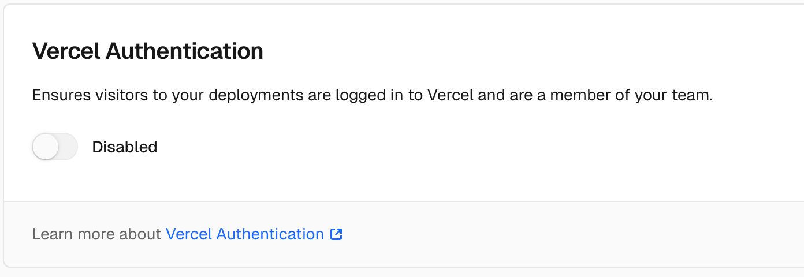
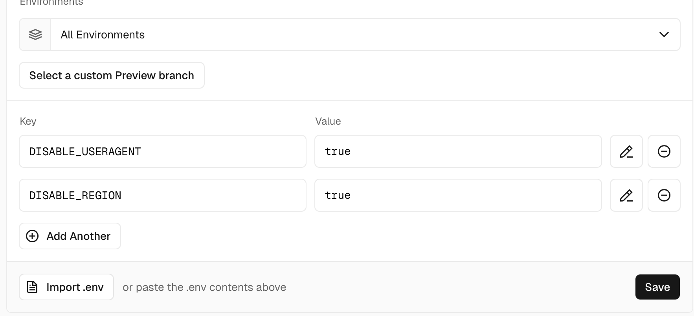



## 修改头像下面的链接

`config/_default/menu.toml`掌管头像下面那几个icon。你可以直接删掉，或者换上你喜欢的网站。

网站图标默认仓库里并没有，去[这个网站](https://tabler.io/icons)找你喜欢的。

下载好一个svg文件，放入`assets/icons`文件夹（没有就新建一个）（右键有新建文件选项）（你可以直接拖拽进来）（我下载的是`device-gamepad.svg`）

```toml
[[social]]
identifier = "github" //网站名
name = "GitHub" //还是网站名
url = "https://github.com/CaiJimmy/hugo-theme-stack" //你要改的链接

[social.params]
icon = "brand-github" //你刚刚下载的icon的名字
```

所以经过一番修改，有我的steam主页链接的图标就诞生了！

这是我的代码：

```toml
[[social]]
identifier = "Steam"
name = "Steam"
url = "https://steamcommunity.com/profiles/76561199051896101/"

[social.params]
icon = "steam" //我把svg图片重命名为steam了
```

## 配置评论

参考：[Waline官方教程](https://waline.js.org/guide/get-started) [配置评论功能](https://site.zhelper.net/Hugo/hugo-comment/)

比想象的简单好多啊！注册一个leancloud一个vercel就好了

眼大漏神，忽略了文档里的这句：

> 点击顶部的 Settings - Environment Variables 进入环境变量配置页，并配置三个环境变量 LEAN_ID, LEAN_KEY 和 LEAN_MASTER_KEY 。它们的值分别对应上一步在 LeanCloud 中获得的 APP ID, APP KEY, Master Key。

给我折腾了半个小时。

还有注意把vercel的Authentication关掉，不然会出现`401 unauthorized`，因为开了authentication的话，就只有登录了vercel才能进行读写，网站本身就无法使用这个服务了。


为了取消评论区对IP地址和浏览器型号的显示，需要添加这两个环境变量，再redeploy一下。

| Name                | Value  |
| ------------------- | ------ |
| `DISABLE_USERAGENT` | `true` |
| `DISABLE_REGION`    | `true` |







